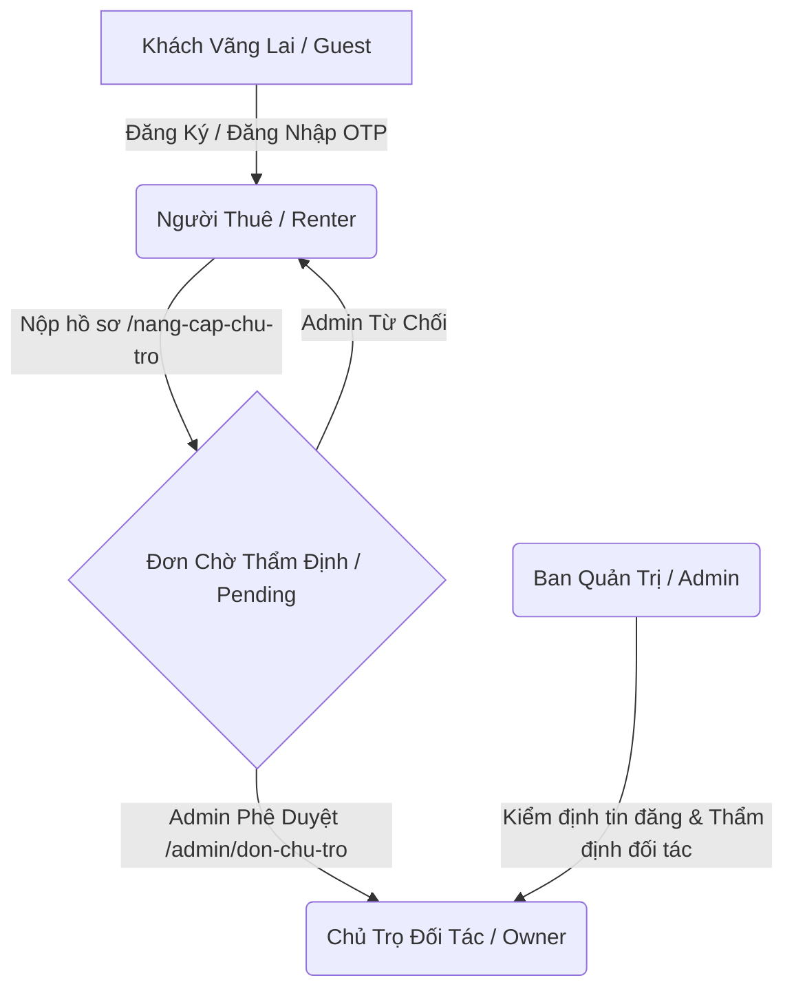

# 🏠 Trọ Xinh - Nền Tảng Thuê & Quản Lý Nhà Trọ Đã Kiểm Duyệt (TroXinh.vn)

> **Tài liệu Kỹ Thuật & Hướng Dẫn Triển Khai Production (Developer & QA Manual)**  
> *Phiên bản: 2.0.0-PROD | Khu vực hoạt động trọng điểm: Hà Nội*

---

## 📌 1. Giới Thiệu Tổng Quan

**Trọ Xinh (TroXinh.vn)** là nền tảng công nghệ bất động sản cho thuê chuyên biệt dành cho sinh viên và người đi làm tại Hà Nội. Nền tảng kết nối trực tiếp **Người thuê phòng (Renter)**, **Chủ nhà trọ đối tác (Owner)** và **Ban Quản Trị thẩm định (Admin)** nhằm loại bỏ hoàn toàn các tin đăng ảo, môi giới gian lận và rủi ro tiền cọc.

- **Thiết kế & Giao diện:** Chuẩn hóa theo thiết kế Stitch với hệ thống Design Tokens nhất quán, tông màu chủ đạo **Forest Green (#006d37)**, font chữ **Be Vietnam Pro**.
- **Trải nghiệm người dùng:** Responsive 100% (Mobile/Tablet/Desktop), thanh điều hướng đáy (Bottom Navigation) thông minh, hệ thống Toast phản hồi thời gian thực và modal xác thực an toàn.

---

## 🛠️ 2. Công Nghệ & Kiến Trúc Hệ Thống

| Thành Phần | Công Nghệ Sử Dụng | Mục Đích |
| :--- | :--- | :--- |
| **Frontend Core** | React 18.3, TypeScript 5.7, Vite 6 | Nền tảng ứng dụng SPA hiệu năng cao |
| **Styling** | Tailwind CSS v3 | Hệ thống UI bám sát Design Tokens từ Stitch |
| **Icons & Animation** | Lucide React Icons, Framer Motion | Biểu tượng hiện đại và hiệu ứng mượt mà |
| **State & Storage** | Zustand v5 + Persist Middleware | Quản lý trạng thái phân quyền và dữ liệu người dùng |
| **Routing & Guards** | React Router DOM v6 | Điều hướng và kiểm soát truy cập phân quyền |
| **Backend & Database** | Supabase (PostgreSQL, Auth, Storage) | Quản lý xác thực, cơ sở dữ liệu và lưu trữ media |
| **Build & Deploy** | Rollup / Vercel Edge Network | Tối ưu hóa bundle và triển khai tự động CI/CD |

---

## 🔐 3. Mô Hình Phân Quyền & Bảo Mật (RBAC Model)

Hệ thống quản lý 4 cấp độ người dùng với các lớp bảo vệ tuyến đường (Route Guards) nghiêm ngặt:



### 3.1. Ma Trận Quyền Hạn (Permission Matrix)

| Chức Năng / Module | Khách (Guest) | Người Thuê (Renter) | Chủ Trọ (Owner) | Ban Quản Trị (Admin) |
| :--- | :---: | :---: | :---: | :---: |
| Xem Trang Chủ, Tìm Kiếm, Bản Đồ | ✅ | ✅ | ✅ | ✅ |
| Xem Chi Tiết Phòng, Tòa Nhà, Hồ Sơ | ✅ | ✅ | ✅ | ✅ |
| Xem Chợ Đồ Cũ, Tìm Bạn Ở Ghép | ✅ | ✅ | ✅ | ✅ |
| Lưu phòng yêu thích (`/da-luu`) | ❌ *(Nhắc login)* | ✅ | ✅ | ✅ |
| Đặt lịch xem phòng (`/dat-lich/:id`) | ❌ *(Nhắc login)* | ✅ | ❌ | ❌ |
| Trò chuyện trực tiếp (`/tin-nhan`) | ❌ *(Nhắc login)* | ✅ | ✅ *(Chủ trọ)* | ✅ |
| Nộp đơn nâng cấp chủ trọ (`/nang-cap-chu-tro`) | ❌ | ✅ | ❌ *(Đã là chủ trọ)*| ❌ |
| Bảng điều khiển SaaS Chủ Trọ (`/chu-tro/*`) | ❌ *(Chặn)* | ❌ *(Chặn + Prompt)*| ✅ | ❌ *(Chặn)* |
| Tạo tòa nhà mới (`/chu-tro/toa-nha/tao-moi`) | ❌ | ❌ | ✅ | ❌ |
| Đăng phòng Live Preview (`/chu-tro/phong/tao-moi`)| ❌ | ❌ | ✅ | ❌ |
| Hàng đợi duyệt tin phòng (`/admin/kiem-duyet`) | ❌ *(Chặn)* | ❌ *(Chặn)* | ❌ *(Chặn)* | ✅ |
| Thẩm định đơn đối tác chủ trọ (`/admin/don-chu-tro`)| ❌ *(Chặn)* | ❌ *(Chặn)* | ❌ *(Chặn)* | ✅ |
| Quản lý tài khoản & Analytics (`/admin/*`) | ❌ *(Chặn)* | ❌ *(Chặn)* | ❌ *(Chặn)* | ✅ |

---

## ⚙️ 4. Hướng Dẫn Cài Đặt & Cấu Hình Môi Trường (Real Setup)

### 4.1. Yêu Cầu Tiên Quyết
- **Node.js**: Phiên bản `>= 18.0.0`
- **NPM**: Phiên bản `>= 9.0.0`
- **Tài khoản Supabase**: Đã tạo Project trên [Supabase.com](https://supabase.com)

### 4.2. Các Bước Cài Đặt
```bash
# 1. Clone mã nguồn
git clone https://github.com/linmaru06-alt/troxinhde.git
cd troxinhde

# 2. Cài đặt các thư viện phụ thuộc
npm install

# 3. Tạo file cấu hình môi trường từ mẫu
cp .env.example .env
```

### 4.3. Cấu Hình Biến Môi Trường (`.env`)
Điền các thông số dịch vụ thật vào file `.env`:
```env
# Supabase Configuration
VITE_SUPABASE_URL=https://your-project-id.supabase.co
VITE_SUPABASE_ANON_KEY=your-supabase-anon-key-here

# Media & Maps Services
VITE_GOOGLE_MAPS_API_KEY=your-google-maps-api-key
VITE_CLOUDINARY_CLOUD_NAME=your-cloudinary-cloud-name

# Payment Gateway (Optional)
VITE_MOMO_PARTNER_CODE=your-momo-partner-code

# Developer & QA Flag (Đặt false trên Production)
VITE_ENABLE_DEBUG=false
```

### 4.4. Hướng Dẫn Kết Nối & Khởi Tạo Dữ Liệu Supabase (Seed Data)
1. Truy cập vào **Supabase Dashboard** > **SQL Editor**.
2. Thực thi script khởi tạo bảng (`schema.sql`) bao gồm các bảng: `users`, `buildings`, `rooms`, `roommates`, `marketplace_items`, `notifications`, `threads`, `messages`, `owner_applications`.
3. Nạp dữ liệu khởi tạo mẫu ban đầu cho khu vực Hà Nội thông qua script seed database.
4. Kích hoạt **Row Level Security (RLS)** trên Supabase để bảo vệ dữ liệu theo từng User ID.

### 4.5. Khởi Chạy Ứng Dụng
```bash
# Chạy máy chủ phát triển (Development)
npm run dev
# Truy cập: http://localhost:3000/

# Kiểm tra đóng gói sản phẩm (Production Build)
npm run build
```

---

## 🗺️ 5. Danh Mục Tuyến Đường Hệ Thống (Route Directory)

### 5.1. Phân Hệ Công Khai (Public Core)
- `/` — **Trang Chủ**: Tìm kiếm thông minh theo vị trí, cam kết an tâm kiểm duyệt, phòng gợi ý, bạn ở ghép và chợ đồ cũ.
- `/tim-kiem` & `/tim-phong` — **Tìm Kiếm Phòng Trọ**: Bộ lọc theo Quận tại Hà Nội (Cầu Giấy, Đống Đa, Hai Bà Trưng, Thanh Xuân...), mức giá, loại phòng, tiện ích.
- `/ban-do` — **Bản Đồ Tương Tác**: Định vị phòng trọ theo giá thuê, hiển thị các cụm trường đại học trọng điểm (ĐHQG, ĐH Bách Khoa, FTU) và lưu vực sông Hồng.
- `/phong/:id` — **Chi Tiết Phòng Trọ**: Thư viện ảnh chất lượng cao, chi phí điện nước minh bạch, danh sách tiện nghi, đánh giá từ người thuê trước.
- `/toa-nha/:id` — **Hồ Sơ Tòa Nhà**: Thông tin pháp lý, tiện ích chung (thang máy, PCCC, nhà để xe) và danh sách phòng trống trong tòa.
- `/roommate` & `/tim-ban-cung-phong` — **Cộng Đồng Tìm Bạn Ở Ghép**: Ghép đôi bạn cùng phòng theo ngân sách, thói quen sinh hoạt và giới tính.
- `/roommate/:id` — **Chi Tiết Hồ Sơ Bạn Ghép**: Thông tin trường học, phòng trọ liên kết và liên hệ trực tiếp.
- `/cho-do-cu` & `/cho-do-cu/:id` — **Chợ Đồ Cũ Sinh Viên**: Kênh mua bán, thanh lý đồ dùng học tập, nội thất cũ giá rẻ và đồ tặng 0đ.
- `/ve-chung-toi/kiem-duyet` — **Trang Quy Trình Kiểm Định**: Cam kết kiểm tra thực tế 100% trong vòng 24h và bảo vệ tiền cọc.

### 5.2. Xác Thực & Bảo Mật (Authentication)
- `/dang-nhap` — Đăng nhập bằng Số điện thoại + Mật khẩu.
- `/dang-ky` — Đăng ký tài khoản (Người thuê / Chủ nhà trọ).
- `/xac-thuc-otp` — Xác thực OTP 6 số bảo vệ tài khoản.
- `/quen-mat-khau` — Quy trình khôi phục mật khẩu bảo mật qua OTP.

### 5.3. Trải Nghiệm Người Thuê (Renter)
- `/onboarding` — Hướng dẫn sử dụng nền tảng cho người thuê.
- `/toi` & `/ho-so` — Trang cá nhân, thông tin trường đại học, quản lý các lịch hẹn xem phòng.
- `/da-luu` — Danh mục phòng trọ đã lưu yêu thích.
- `/thong-bao` — Trung tâm thông báo hệ thống và lịch xem phòng.
- `/tin-nhan` & `/tin-nhan/:threadId` — Hộp thư trò chuyện bảo mật với chủ nhà trọ.
- `/dat-lich/:roomId` — Biểu mẫu đặt lịch hẹn xem phòng trực tiếp theo khung giờ.
- `/nang-cap-chu-tro` — Nộp hồ sơ đăng ký thẩm định trở thành Chủ Trọ Đối Tác.
- `/nang-cap-chu-tro/trang-thai` — Màn hình theo dõi tiến độ thẩm định hồ sơ.

### 5.4. Hệ Thống SaaS Dành Cho Chủ Trọ (Owner Dashboard)
- `/chu-tro/onboarding` — Hướng dẫn số hóa quy trình quản lý dành cho chủ nhà trọ.
- `/chu-tro` & `/chu-tro/tong-quan` — **Bảng Điều Khiển Tổng Quan**: Theo dõi tỷ lệ lấp đầy phòng, doanh thu ước tính, cập nhật trạng thái phòng nhanh.
- `/chu-tro/toa-nha` — Quản lý danh mục các cơ sở / tòa nhà trọ.
- `/chu-tro/toa-nha/tao-moi` — Quy trình 3 bước khai báo tòa nhà mới.
- `/chu-tro/toa-nha/:id` — Quản lý chi tiết cơ sở nhà trọ.
- `/chu-tro/phong/tao-moi` — Biểu mẫu đăng phòng với **Live Preview Card thời gian thực**.
- `/chu-tro/phong/:id` — Quản lý chi tiết phòng, chỉ số lượt xem/lưu, điều chỉnh giá thuê.
- `/chu-tro/tin-nhan` — Kênh trao đổi trực tiếp với khách thuê tiềm năng.
- `/chu-tro/thong-bao` — Thông báo vận hành và phản hồi từ Ban Quản Trị.
- `/chu-tro/toi` — Hồ sơ định danh chủ trọ đối tác.

### 5.5. Quản Trị Hệ Thống (Admin Portal)
- `/admin` & `/admin/kiem-duyet` — **Hàng Đợi Duyệt Tin Phòng**: Xem xét thông số, hình ảnh phòng và duyệt tin hoặc từ chối kèm lý do.
- `/admin/don-chu-tro` — **Thẩm Định Đơn Đăng Ký Chủ Trọ**: Kiểm tra CCCD, giấy phép PCCC và cấp quyền Chủ Trọ chính thức.
- `/admin/nguoi-dung` — Quản lý danh sách tài khoản toàn hệ thống (phân quyền, khóa/mở tài khoản).
- `/admin/thong-ke` — Báo cáo tăng trưởng, phân tích nguồn cung phòng theo các quận Hà Nội.

---

## 🔒 6. Tiêu Chuẩn Bảo Mật Production (Production Hardening)

Để bảo đảm an toàn khi triển khai lên môi trường Live:
1. **Khóa Route Debug:** Tuyến đường `/debug` tự động chuyển hướng về `/` trên môi trường Production (`import.meta.env.PROD === true`) hoặc khi `VITE_ENABLE_DEBUG !== 'true'`.
2. **Loại Bỏ Hoàn Toàn Demo Artifacts:**
   - Không còn nút 1-Click Login hay thông tin tài khoản hardcoded trong mã nguồn.
   - Form đăng nhập và OTP yêu cầu nhập liệu chính xác.
   - Initial state khởi tạo ở chế độ khách (`currentUser: null`), bảo đảm trải nghiệm xác thực thực tế.
3. **Bảo Vệ Biến Môi Trường:**
   - Các file `.env`, `.env.local`, `.env.production` được khai báo trong `.gitignore` để ngăn chặn rò rỉ API Keys lên GitHub.
   - Cung cấp file mẫu `.env.example` chuẩn hóa để triển khai môi trường mới.
4. **Vercel Edge Rewrite:** Tệp [`vercel.json`](file:///c:/Users/Windows/.gemini/antigravity-ide/scratch/tr%C3%B5inhdemo/vercel.json) cấu hình sẵn các quy tắc rewrite cho Single Page Application (SPA), ngăn ngừa lỗi HTTP 404 khi người dùng tải lại trang trên các route con.

---

## 📁 7. Cấu Trúc Thư Mục Mã Nguồn

```
trõinhdemo/
├── public/                 # Static public assets & favicon
├── src/
│   ├── components/
│   │   ├── layout/         # Navbar, Footer, MobileBottomNav, DashboardSidebar
│   │   ├── search/         # GuestPromptBanner, SearchFilters
│   │   ├── rooms/          # RoomCard, RoomFilters, GuestViewingBar
│   │   └── ui/             # Badge, Button, Input, Modal, Skeleton, Toast...
│   ├── data/
│   │   └── mockData.ts     # Dữ liệu hạt giống (Seed dataset Hà Nội)
│   ├── pages/              # 35 trang chức năng phân hệ (Public, Auth, Renter, Owner, Admin)
│   ├── store/
│   │   └── useAppStore.ts  # Zustand store tích hợp LocalStorage persistence & action handlers
│   ├── types/
│   │   └── index.ts        # TypeScript interfaces & types định nghĩa toàn diện
│   ├── App.tsx             # Định tuyến Router v6 & bảo vệ quyền truy cập (OwnerRoute, AdminRoute)
│   ├── index.css           # Cấu hình Tailwind CSS & Custom Theme Tokens
│   └── main.tsx            # Điểm khởi chạy ứng dụng React
├── .env.example            # Mẫu biến môi trường bảo mật
├── .gitignore              # Danh mục loại trừ mã nguồn và biến môi trường
├── vercel.json             # Cấu hình định tuyến máy chủ Vercel SPA
├── package.json            # Danh sách thư viện và scripts vận hành
└── README.md               # Tài liệu bàn giao kỹ thuật & hướng dẫn triển khai
```

---

*Tài liệu được cập nhật và kiểm duyệt bởi **Antigravity IDE** phục vụ tiêu chuẩn bàn giao mã nguồn sạch và bảo mật sản phẩm TroXinh.vn.*
