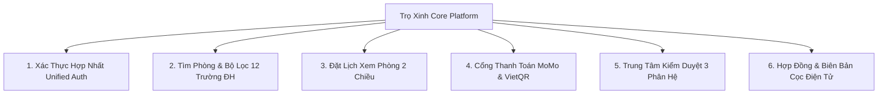

# 🏠 Trọ Xinh - Nền Tảng Thuê & Quản Lý Nhà Trọ Sinh Viên Uy Tín (TroXinh.vn)

> **Tài liệu Kỹ Thuật & Hướng Dẫn Triển Khai Production (Developer & QA Manual)**  
> *Slogan: Giá Tốt, Gần Bạn, Chốt Nhanh | Khu vực trọng điểm: Hà Nội*  
> 📋 **Phiếu Thu Thập Thông Tin Triển Khai Thực Tế:** [docs/PHIEU_THU_THAP_THONG_TIN.md](file:///c:/Users/Windows/.gemini/antigravity-ide/scratch/tr%C3%B5inhdemo/docs/PHIEU_THU_THAP_THONG_TIN.md)

---

## 📌 1. Giới Thiệu Tổng Quan

**Trọ Xinh (TroXinh.vn)** là nền tảng công nghệ tìm và quản lý phòng trọ minh bạch dành cho sinh viên và người đi làm tại Hà Nội. Nền tảng kết nối trực tiếp **Người thuê phòng (Renter)** và **Chủ nhà trọ chính chủ (Owner)** dưới sự kiểm định nghiêm ngặt của **Ban Quản Trị (Admin)** nhằm loại bỏ hoàn toàn các tin đăng ảo, môi giới gian lận và rủi ro mất tiền cọc.

- **Thiết kế & Giao diện:** Chuẩn giao diện Chợ Tốt với tông màu xanh thương hiệu **#00a854**, banner gradient tỏa sáng vàng ấm ở giữa, thanh tìm kiếm docked tuyệt đối 50/50, mascot 3D Trọ Xinh độc quyền và font chữ **Be Vietnam Pro** hiển thị chuẩn xác tiếng Việt.
- **Trải nghiệm di động:** Hỗ trợ PWA (Progressive Web App), thanh điều hướng đáy (Bottom Navigation) tiện lợi, responsive 100% trên mọi kích thước màn hình.

---

## 🚀 2. Các Phân Hệ & Tính Năng Nổi Bật Cốt Lõi



### ✅ 1. Xác Thực Hợp Nhất 1-Chạm (Unified Passwordless & Social Auth)
- **Giao diện Modal Popup Chợ Tốt:** Popup đăng nhập toàn cục kèm mascot hoạt hình 3D Trọ Xinh, mở ngay tức thì từ mọi trang web.
- **Cơ chế Hợp Nhất 1-Luồng (Unified Engine):** Người dùng không cần phân vân giữa "Đăng ký" hay "Đăng nhập". Hệ thống tự động kiểm tra Supabase:
  - Nếu số điện thoại / email chưa có ➔ **Tự động Đăng ký mới**.
  - Nếu đã tồn tại ➔ **Tự động truy xuất hồ sơ và Đăng nhập ngay**.
- **Đa phương thức đăng nhập hiện đại:**
  - 🌐 **Google OAuth Popup:** Cửa sổ chọn tài khoản Google Account Chooser chính thức.
  - 👤 **Facebook & Apple Sign-In:** Đăng nhập nhanh qua tài khoản mạng xã hội.
  - 📱 **Số điện thoại & OTP 6 số:** Xác thực an toàn, kèm nút 1-chạm tự động điền mã OTP thử nghiệm.

### ✅ 2. Cổng Thanh Toán MoMo & VietQR Chuẩn Doanh Nghiệp
- **Ví Điện Tử MoMo:**
  - 📱 **Mobile Deeplink (`momo://app?action=pay...`):** Bấm 1-chạm mở trực tiếp App MoMo để xác thực FaceID / Vân tay thanh toán trong 2 giây.
  - 💻 **Dynamic QR MoMo Napas (Mã 970422):** Tự động khóa cứng số tiền và mã hóa đơn, chống tuyệt đối việc chuyển nhầm tiền hoặc quên nội dung.
  - ⏱️ Đồng hồ đếm ngược giao dịch an toàn 15 phút, bộ nút sao chép 1-chạm có phản hồi trực quan.
- **Chuyển Khoản VietQR / PayOS:** Quét mã QR thanh toán liên ngân hàng 24/7 qua 40+ ứng dụng ngân hàng tại Việt Nam.
- **Xuất Biên Lai & Hóa Đơn PDF:** Tự động tạo biên lai thu tiền điện tử chuẩn mẫu kế toán.

### ✅ 3. Tìm Phòng Xác Minh, Lọc 12 Trường ĐH & Bóc Tách Tổng Chi Phí
- Bộ lọc `🛡️ Chỉ phòng đã xác minh`, lọc theo khoảng giá, loại phòng (Studio, Gác xép, Chung cư mini) và hơn 12 trường Đại học lớn tại Hà Nội (ĐHQG, Bách Khoa, Kinh Tế Quốc Dân, Ngoại Thương, Bưu Chính Viễn Thông, Xây Dựng...).
- Thẻ phòng hiển thị song song **Đơn giá thuê** và **Tổng chi phí dự kiến / tháng** (tiền phòng + điện + nước + internet) tránh phát sinh chi phí bất ngờ.

### ✅ 4. Luồng Đặt Lịch Xem Phòng Trực Tiếp & Xác Nhận 2 Chiều
- Trang đặt lịch `/dat-lich/:id` với lưới chọn khung giờ rảnh (Sáng/Chiều/Tối), nhập thông tin liên hệ và ghi chú cho chủ trọ.
- Người thuê theo dõi trạng thái lịch hẹn (`⏳ Chờ xác nhận`, `✅ Đã xác nhận`, `❌ Đã hủy`).
- Chủ trọ quản lý và xác nhận đón khách hoặc gọi điện trực tiếp 1-chạm từ Dashboard.

### ✅ 5. Hệ Thống Xác Minh Danh Tính & Trung Tâm Kiểm Duyệt 3 Phân Hệ
- **Kiểm duyệt tin đăng phòng:** Duyệt ảnh thực tế, đối chiếu giá thuê, đơn giá điện nước.
- **Thẩm định hồ sơ đối tác chủ trọ:** Kiểm tra số CCCD, giấy tờ tòa nhà, số điện thoại chính chủ.
- **Xử lý báo cáo vi phạm:** Tiếp nhận phản ánh khi người thuê đi xem phòng phát hiện giá sai hoặc phòng ảo, hỗ trợ Admin hạ tin vi phạm lập tức.

### ✅ 6. Hợp Đồng Điện Tử & Biên Bản Đặt Cọc Minh Bạch
- Sửa triệt để lỗi chữ/font tiếng Việt với bộ font **Be Vietnam Pro** và cơ chế `await document.fonts.ready`.
- **Mẫu hợp đồng thuê phòng:** 10 điều khoản bảo vệ pháp lý, hỗ trợ cả 2 chế độ: Điền sẵn thông tin hoặc In bản trắng viết tay.
- **Mẫu biên bản đặt cọc giữ phòng:** 1 trang cô đọng cam kết giữ chỗ và hoàn trả cọc.

### ✅ 7. Trải Nghiệm PWA, Mobile Bottom Navigation & SEO Local
- Thanh điều hướng đáy trên Mobile (Trang chủ, Tìm phòng, Bản đồ, Lịch hẹn, Tài khoản).
- Cấu hình SEO Schema JSON-LD (Accommodation & RealEstateAgent) tối ưu cho các quận Hà Nội.
- Cài đặt Service Worker PWA cho phép cài ứng dụng lên màn hình chính điện thoại.

---

## 🛠️ 3. Công Nghệ Sử Dụng

| Thành Phần | Công Nghệ | Mục Đích |
| :--- | :--- | :--- |
| **Frontend Core** | React 18.3, TypeScript 5.7, Vite 6 | Nền tảng ứng dụng SPA hiệu năng cao |
| **Styling** | Tailwind CSS v3 | Design System chuẩn sắc xanh #00a854 & MoMo magenta #A50064 |
| **Authentication** | Supabase Auth + Firebase SDK | Đăng nhập hợp nhất SĐT OTP, Google OAuth & Facebook |
| **Database & Realtime** | Supabase PostgreSQL | Lưu trữ người dùng, phòng trọ, đơn hàng và thông báo |
| **Payment Gateway** | MoMo Gateway v2 & PayOS VietQR | Cổng thanh toán MoMo Deeplink & VietQR Napas |
| **State Management** | Zustand v5 + Persist Middleware | Quản lý dữ liệu người dùng, giỏ hàng, phòng, lịch hẹn |
| **Map Engine** | Leaflet & React Leaflet | Hiển thị bản đồ vị trí phòng trọ theo trường ĐH |
| **PDF Engine** | jsPDF & html2canvas | Xuất hợp đồng thuê trọ, biên bản cọc và biên lai thu tiền |
| **PWA** | vite-plugin-pwa (Workbox) | Hỗ trợ cài đặt ứng dụng trên iOS / Android / Desktop |

---

## ⚙️ 4. Hướng Dẫn Chạy & Cài Đặt Local

### 4.1. Yêu Cầu
- **Node.js**: `>= 18.0.0`
- **NPM**: `>= 9.0.0`

### 4.2. Cài Đặt & Khởi Chạy
```bash
# 1. Cài đặt các gói phụ thuộc
npm install

# 2. Chạy môi trường phát triển (Local Dev Server)
npm run dev

# 3. Kiểm tra build Production
npm run build
```

---

## 👥 5. Tài Khoản Thử Nghiệm Nhanh (1-Chạm Demo Accounts)

Bạn có thể bấm trực tiếp các nút 1-chạm (Người thuê, Chủ trọ, Admin) ngay trên Modal Đăng Nhập hoặc sử dụng thông tin sau:

| Vai Trò | Tên Hiển Thị | Số Điện Thoại / Email | Chức Năng Chính |
| :--- | :--- | :--- | :--- |
| **Người Thuê (Renter)** | Nguyễn Văn An | `0988110789` / `nguoithue@troxinh.vn` | Tìm phòng, đặt lịch xem phòng, xem hợp đồng mẫu, báo cáo tin |
| **Chủ Trọ (Owner)** | Trần Quốc Tuấn | `0912345678` / `chutro@troxinh.vn` | Quản lý tòa nhà, đăng phòng, đẩy tin VIP, duyệt lịch hẹn |
| **Ban Quản Trị (Admin)** | Ban Quản Trị Trọ Xinh | `0888110789` / `admin@troxinh.vn` | Kiểm duyệt phòng, thẩm định chủ trọ, xử lý báo cáo vi phạm |

---

© 2026 **Trọ Xinh Việt Nam (TroXinh.vn)**. Vận hành bởi **Nguyễn Vũ Chính** (18 Ngõ 167 Tây Sơn, Đống Đa, Hà Nội).  
Hotline: **0888 110 789** | Email: **nguyenvuchinhb1hhb@gmail.com**.

