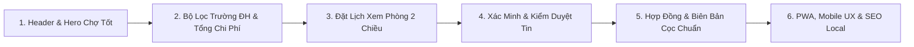

# 🏠 Trọ Xinh - Nền Tảng Thuê & Quản Lý Nhà Trọ Sinh Viên Uy Tín (TroXinh.vn)

> **Tài liệu Kỹ Thuật & Hướng Dẫn Triển Khai Production (Developer & QA Manual)**  
> *Slogan: Giá Tốt, Gần Bạn, Chốt Nhanh | Khu vực trọng điểm: Hà Nội*  
> 📋 **Phiếu Thu Thập Thông Tin Triển Khai Thực Tế:** [docs/PHIEU_THU_THAP_THONG_TIN.md](file:///c:/Users/Windows/.gemini/antigravity-ide/scratch/tr%C3%B5inhdemo/docs/PHIEU_THU_THAP_THONG_TIN.md)

---

## 📌 1. Giới Thiệu Tổng Quan

**Trọ Xinh (TroXinh.vn)** là nền tảng công nghệ tìm và quản lý phòng trọ minh bạch dành cho sinh viên và người đi làm tại Hà Nội. Nền tảng kết nối trực tiếp **Người thuê phòng (Renter)** và **Chủ nhà trọ chính chủ (Owner)** dưới sự kiểm định nghiêm ngặt của **Ban Quản Trị (Admin)** nhằm loại bỏ hoàn toàn các tin đăng ảo, môi giới gian lận và rủi ro mất tiền cọc.

- **Thiết kế & Giao diện:** Chuẩn giao diện Chợ Tốt với tông màu xanh thương hiệu **#00a854**, banner gradient tỏa sáng vàng ấm ở giữa, thanh tìm kiếm docked tuyệt đối 50/50 và font chữ **Be Vietnam Pro** hiển thị chuẩn xác tiếng Việt.
- **Trải nghiệm di động:** Hỗ trợ PWA (Progressive Web App), thanh điều hướng đáy (Bottom Navigation) tiện lợi, responsive 100% trên mọi kích thước màn hình.

---

## 🚀 2. 6 Bước Triển Khai Hoàn Thiện Dự Án

Hệ thống đã hoàn thành 100% lộ trình 6 bước tái định vị sản phẩm:



### ✅ BƯỚC 1: Cấu Trúc Header & Hero Banner Chuẩn Chợ Tốt
- **Header:** Nền xanh `#00a854`, logo viên thuốc trắng nổi bật, dropdown "Dành cho chủ trọ ▾", nút đen `[ĐĂNG TIN ➕]`.
- **Hero Banner:** Gradient xanh sáng tỏa ánh vàng ấm ở giữa kèm slogan *"Giá Tốt, Gần Bạn, Chốt Nhanh"*.
- **Docked Search Bar:** Thanh tìm kiếm neo chuẩn xác 50% trên banner và 50% trên nền trang, nút tìm kiếm xanh thương hiệu.

### ✅ BƯỚC 2: Tìm Phòng Xác Minh, Lọc 12 Trường ĐH & Bóc Tách Tổng Chi Phí
- Bộ lọc `🛡️ Chỉ phòng đã xác minh`, bộ lọc khoảng giá, loại phòng và hơn 12 trường Đại học lớn tại Hà Nội (ĐHQG, Bách Khoa, Kinh Tế Quốc Dân, Ngoại Thương, Xây Dựng...).
- Thẻ phòng hiển thị song song **Đơn giá thuê** và **Tổng chi phí dự kiến / tháng** (tiền phòng + điện + nước + internet) tránh phát sinh chi phí bất ngờ.

### ✅ BƯỚC 3: Luồng Đặt Lịch Xem Phòng Trực Tiếp & Xác Nhận 2 Chiều
- Trang đặt lịch `/dat-lich/:id` với lưới chọn khung giờ rảnh (Sáng/Chiều/Tối), nhập thông tin liên hệ và ghi chú cho chủ trọ.
- Người thuê theo dõi trạng thái lịch hẹn (`⏳ Chờ xác nhận`, `✅ Đã xác nhận`, `❌ Đã hủy`).
- Chủ trọ quản lý và xác nhận đón khách hoặc gọi điện trực tiếp 1-chạm từ Dashboard.

### ✅ BƯỚC 4: Hệ Thống Xác Minh Danh Tính & Trung Tâm Kiểm Duyệt 3 Phân Hệ
- **Kiểm duyệt tin đăng phòng:** Duyệt ảnh thực tế, đối chiếu giá thuê, đơn giá điện nước.
- **Thẩm định hồ sơ đối tác chủ trọ:** Kiểm tra số CCCD, giấy tờ tòa nhà, số điện thoại chính chủ.
- **Xử lý báo cáo vi phạm:** Tiếp nhận phản ánh khi người thuê đi xem phòng phát hiện giá sai hoặc phòng ảo, hỗ trợ Admin hạ tin vi phạm lập tức.

### ✅ BƯỚC 5: Hợp Đồng Điện Tử & Biên Bản Đặt Cọc Minh Bạch
- Sửa triệt để lỗi chữ/font tiếng Việt với bộ font **Be Vietnam Pro** và cơ chế `await document.fonts.ready`.
- **Mẫu hợp đồng thuê phòng:** 10 điều khoản bảo vệ pháp lý, hỗ trợ cả 2 chế độ: Điền sẵn thông tin hoặc In bản trắng viết tay.
- **Mẫu biên bản đặt cọc giữ phòng:** 1 trang cô đọng cam kết giữ chỗ và hoàn trả cọc.

### ✅ BƯỚC 6: Trải Nghiệm PWA, Mobile Bottom Navigation & SEO Local
- Thanh điều hướng đáy trên Mobile (Trang chủ, Tìm phòng, Bản đồ, Lịch hẹn, Tài khoản).
- Cấu hình SEO Schema JSON-LD (Accommodation & RealEstateAgent) tối ưu cho các quận Hà Nội.
- Cài đặt Service Worker PWA cho phép cài ứng dụng lên màn hình chính điện thoại.

---

## 🛠️ 3. Công Nghệ Sử Dụng

| Thành Phần | Công Nghệ | Mục Đích |
| :--- | :--- | :--- |
| **Frontend Core** | React 18.3, TypeScript 5.7, Vite 6 | Nền tảng ứng dụng SPA hiệu năng cao |
| **Styling** | Tailwind CSS v3 | Design System chuẩn sắc xanh #00a854 |
| **Icons & Animation** | Lucide React, Framer Motion | Giao diện hiện đại, chuyển động mượt mà |
| **State Management** | Zustand v5 + Persist Middleware | Quản lý dữ liệu người dùng, phòng, lịch hẹn, báo cáo |
| **Map Engine** | Leaflet & React Leaflet | Hiển thị bản đồ vị trí phòng trọ theo trường ĐH |
| **PDF Engine** | jsPDF & html2canvas | Xuất hợp đồng thuê trọ, biên bản cọc và biên lai thu tiền |
| **PWA** | vite-plugin-pwa | Hỗ trợ cài đặt ứng dụng trên iOS / Android / Desktop |

---

## ⚙️ 4. Hướng Dẫn Chạy & Cài Đặt Local

### 4.1. Yêu Cầu
- **Node.js**: `>= 18.0.0`
- **NPM**: `>= 9.0.0`

### 4.2. Cài Đặt & Khởi Chạy
```bash
# 1. Cài đặt các gói phụ thuộc
npm install

# 2. Chạy môi trường phát triển (Local Dev Server)
npm run dev

# 3. Kiểm tra build Production
npm run build
```

---

## 👥 5. Tài Khoản Thử Nghiệm Nhanh (Demo Accounts)

Bạn có thể chuyển đổi vai trò ngay trên thanh Header hoặc sử dụng các tài khoản mẫu sau:

| Vai Trò | Tên Hiển Thị | Số Điện Thoại | Chức Năng Chính |
| :--- | :--- | :--- | :--- |
| **Người Thuê (Renter)** | Nguyễn Minh Anh | `0987654321` | Tìm phòng, đặt lịch xem phòng, xem hợp đồng mẫu, báo cáo tin |
| **Chủ Trọ (Owner)** | Trần Quốc Tuấn | `0988112233` | Quản lý tòa nhà, đăng phòng, duyệt lịch hẹn xem phòng |
| **Ban Quản Trị (Admin)** | Admin Trọ Xinh | `0888110789` | Kiểm duyệt phòng, thẩm định chủ trọ, xử lý báo cáo vi phạm |

---

© 2026 **Trọ Xinh Việt Nam (TroXinh.vn)**. Vận hành bởi **Nguyễn Vũ Chính** (18 Ngõ 167 Tây Sơn, Đống Đa, Hà Nội).
Hotline: **0888 110 789** | Email: **nguyenvuchinhb1hhb@gmail.com**.
