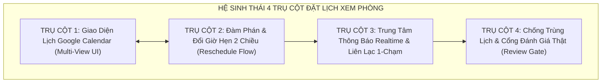
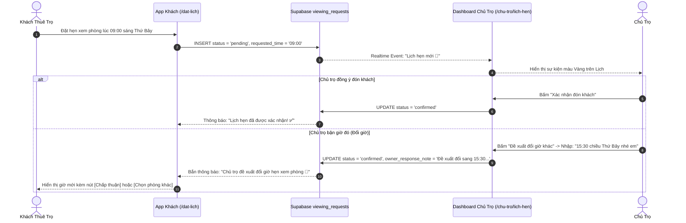

# 📅 KẾ HOẠCH TRIỂN KHAI TOÀN DIỆN: 4 TRỤ CỘT NÂNG CẤP HỆ THỐNG ĐẶT LỊCH XEM PHÒNG & QUẢN LÝ LỊCH HẸN THỜI GIAN THỰC (SMART BOOKING & TWO-WAY SCHEDULING ENGINE)
### DÀNH CHO NỀN TẢNG TRỌ XINH (TROXINH.VN)
*Ứng dụng giao diện chuẩn Google Calendar, đàm phán đổi giờ 2 chiều, thông báo thời gian thực và cổng chống đánh giá ảo (Review Gate - Quy tắc R-04)*

---

## 🎯 TỔNG QUAN HỆ THỐNG

Trước khi nâng cấp, luồng đặt lịch chỉ là một form gửi dữ liệu 1 chiều (Khách gửi ngày giờ $\to$ Lưu vào `localStorage` $\to$ Chủ trọ không có công cụ xem lịch trực quan).  
Hệ thống **4 Trụ Cột Đặt Lịch Xem Phòng** biến Trọ Xinh thành nền tảng đàm phán lịch xem phòng thông minh, khép kín và tự động hóa:



---

## 🏛️ CHI TIẾT 4 TRỤ CỘT KỸ THUẬT

### 1️⃣ TRỤ CỘT 1: GIAO DIỆN LỊCH ĐA CHẾ ĐỘ CHUẨN GOOGLE CALENDAR (MULTI-VIEW SCHEDULING UI)

* **Mục tiêu**: Cung cấp cho chủ trọ công cụ quản lý lịch hẹn trực quan, tương tự Google Calendar / Calendly, không bị bỏ lỡ khách đến xem phòng.
* **Vị trí file mã nguồn**: [`src/pages/OwnerBookingsPage.tsx`](file:///c:/Users/Windows/.gemini/antigravity-ide/scratch/trõinhdemo/src/pages/OwnerBookingsPage.tsx)
* **Các tính năng cốt lõi**:
  1. **3 Chế độ xem linh hoạt (View Modes)**:
     - 🗓️ **Chế độ Tháng (Month View)**: Lưới 35-42 ô ngày chuẩn lịch phương Tây (Thứ 2 $\to$ Chủ nhật), hiển thị số lượng cuộc hẹn trong từng ngày và các chip sự kiện có màu sắc nhận diện.
     - 📆 **Chế độ Tuần (Week View)**: Chia 7 cột tương ứng 7 ngày trong tuần, phân bố các khung giờ vàng từ `08:00` đến `20:00`.
     - 📋 **Chế độ Danh sách (List / Agenda View)**: Dạng thẻ mở rộng, có thanh tìm kiếm nhanh theo tên khách, số điện thoại, tên phòng và bộ lọc theo trạng thái.
  2. **Bảng màu nhận diện chuẩn Google Calendar**:
     - 🟡 **Màu Vàng / Hổ Phách (Amber)**: *Chờ chủ trọ xác nhận*
     - 🟢 **Màu Xanh Lá (Emerald)**: *Đã xác nhận đón khách*
     - 🟣 **Màu Tím (Purple)**: *Đã xem phòng xong (Hoàn thành)*
     - 🔴 **Màu Đỏ / Hồng (Rose)**: *Đã hủy / Từ chối*
  3. **Event Modal Popup**: Bấm vào bất kỳ sự kiện nào trên lịch để mở pop-up hiển thị đầy đủ thông tin: Avatar khách, Tên, Số điện thoại, Phòng cần xem, Thời gian và Lời nhắn riêng.

---

### 2️⃣ TRỤ CỘT 2: CƠ CHẾ ĐÀM PHÁN & ĐỔI GIỜ HẸN HAI CHIỀU (TWO-WAY RESCHEDULING FLOW)

* **Mục tiêu**: Xóa bỏ tình trạng "Bận là hủy". Cho phép chủ trọ linh hoạt đề xuất dời giờ sang khung giờ rảnh khác và khách thuê có thể đồng ý hoặc từ chối ngay trên app.
* **Vị trí file mã nguồn**: 
  - [`src/pages/OwnerBookingsPage.tsx`](file:///c:/Users/Windows/.gemini/antigravity-ide/scratch/trõinhdemo/src/pages/OwnerBookingsPage.tsx) (Hàm `handleUpdateStatus` & Block `isRescheduling`)
  - [`src/lib/api/bookings.ts`](file:///c:/Users/Windows/.gemini/antigravity-ide/scratch/trõinhdemo/src/lib/api/bookings.ts) (Hàm `updateViewingRequestStatus`)
  - [`src/pages/BookingPage.tsx`](file:///c:/Users/Windows/.gemini/antigravity-ide/scratch/trõinhdemo/src/pages/BookingPage.tsx) (Khách đặt lịch ban đầu)
* **Luồng đàm phán 2 chiều (Sequence Diagram)**:



---

### 3️⃣ TRỤ CỘT 3: TRUNG TÂM THÔNG BÁO THỜI GIAN THỰC & LIÊN LẠC 1-CHẠM (REALTIME NOTIFICATIONS & OMNICHANNEL)

* **Mục tiêu**: Đảm bảo thông tin cuộc hẹn được truyền tải tức thì (Instant Delivery) và tạo cầu nối liên lạc nhanh nhất giữa hai bên.
* **Vị trí file mã nguồn**:
  - [`src/lib/api/bookings.ts`](file:///c:/Users/Windows/.gemini/antigravity-ide/scratch/trõinhdemo/src/lib/api/bookings.ts) (Tự động insert vào bảng `notifications`)
  - [`src/pages/NotificationsPage.tsx`](file:///c:/Users/Windows/.gemini/antigravity-ide/scratch/trõinhdemo/src/pages/NotificationsPage.tsx) (Giao diện trung tâm thông báo của khách)
  - [`src/pages/OwnerNotificationsPage.tsx`](file:///c:/Users/Windows/.gemini/antigravity-ide/scratch/trõinhdemo/src/pages/OwnerNotificationsPage.tsx) (Giao diện thông báo của chủ trọ)
* **Các tính năng cốt lõi**:
  1. **Tự động kích hoạt Notification Event**:
     ```ts
     await supabase.from('notifications').insert({
       user_id: updatedReq.renter_id,
       type: 'booking_update',
       title: `Lịch hẹn xem phòng: ${displayStatus} 📋`,
       body: `Lịch hẹn xem "${roomName}" vào ${requested_date} (${requested_time}) đã chuyển sang: ${displayStatus}.`,
       cta_url: '/lich-hen',
       cta_label: 'Xem lịch hẹn',
       is_read: false,
     });
     ```
  2. **Modal Xem Chi Tiết Thông Báo (Không bị trôi tin)**:
     - Khách hoặc chủ trọ bấm vào thẻ thông báo $\to$ Mở modal popup đọc toàn văn lời nhắn, thời gian nhận tin, và nút CTA dẫn đường trực tiếp tới lịch hẹn.
  3. **Kết nối đa kênh 1-chạm (Omnichannel)**:
     - 📞 **Nút Gọi Điện Trực Tiếp (`tel:${renterPhone}`)**: Bấm 1 chạm tự động quay số trên điện thoại mà không cần gõ lại số.
     - 💬 **Nút Nhắn Tin Trực Tiếp (`/chu-tro/tin-nhan` hoặc `/tin-nhan`)**: Mở ngay cuộc hội thoại với khách, tự động đính kèm thông tin phòng trọ đang hẹn xem.

---

### 4️⃣ TRỤ CỘT 4: CHỐNG TRÙNG LỊCH & CỔNG KIỂM SOÁT ĐÁNH GIÁ THẬT (ANTI-COLLISION & REVIEW GATE)

* **Mục tiêu**: Bảo vệ trải nghiệm xem phòng thực tế, chống xung đột thời gian và triệt tiêu 100% đánh giá rác/ảo trên nền tảng.
* **Vị trí file mã nguồn**:
  - Schema CSDL: [`supabase/migrations/010_unified_public_beta_schema.sql`](file:///c:/Users/Windows/.gemini/antigravity-ide/scratch/trõinhdemo/supabase/migrations/010_unified_public_beta_schema.sql)
  - Kiểm soát Review: [`src/pages/RoomDetailPage.tsx`](file:///c:/Users/Windows/.gemini/antigravity-ide/scratch/trõinhdemo/src/pages/RoomDetailPage.tsx)
  - Kiểm thử tự động: [`scripts/test-real-chat-booking.mjs`](file:///c:/Users/Windows/.gemini/antigravity-ide/scratch/trõinhdemo/scripts/test-real-chat-booking.mjs)
* **Cơ chế hoạt động**:
  1. **Chống trùng khung giờ (Anti-Collision)**:
     - Khi một khung giờ đã được chủ trọ bấm "Xác nhận", khung giờ đó sẽ bị vô hiệu hóa (disabled) trên trang đặt lịch của phòng trọ đó, ngăn chặn 2 khách đến cùng lúc.
  2. **Cổng kiểm duyệt Review Gate (Quy tắc an ninh R-04)**:
     - Không cho phép người dùng lạ tự do vào đánh giá 1 sao hoặc 5 sao ảo.
     - Hệ thống chỉ mở form đánh giá khi kiểm tra trong bảng `viewing_requests` có bản ghi thỏa mãn:
       $$\text{renter\_id} = \text{auth.uid()} \quad \text{AND} \quad \text{room\_id} = \text{target\_room} \quad \text{AND} \quad \text{status} = \text{'completed'}$$
     - Nhờ đó, 100% đánh giá trên Trọ Xinh đều là đánh giá từ **người thật đã đi xem phòng thực tế**.

---

## 📊 BẢNG TỔNG KẾT SO SÁNH TRƯỚC VÀ SAU NÂNG CẤP

| Tiêu Chí | Trước Khi Nâng Cấp | Sau Khi Triển Khai 4 Trụ Cột |
| :--- | :--- | :--- |
| **Giao diện Chủ trọ** | Danh sách chữ đơn giản, khó hình dung thời gian rảnh. | **Google Calendar đa chế độ (Tháng / Tuần / List)**, phân màu trực quan. |
| **Xử lý khi bận giờ** | Chỉ có thể bấm "Từ chối" hoặc bỏ qua. | **Đàm phán đổi giờ 2 chiều**, gửi đề xuất giờ mới kèm tin nhắn. |
| **Thông báo & Kết nối** | Khách phải tự F5 kiểm tra trạng thái. | **Realtime push thông báo chuông**, nút Gọi điện 1-chạm & Nhắn tin kèm ngữ cảnh phòng. |
| **Chất lượng đánh giá** | Ai cũng có thể submit review vào phòng. | **Review Gate**: Chỉ người đã hoàn thành xem phòng thật (`completed`) mới được đánh giá. |
| **Kiểm thử chất lượng** | Kiểm tra thủ công. | Bộ kịch bản tự động trong `scripts/test-real-chat-booking.mjs`. |
