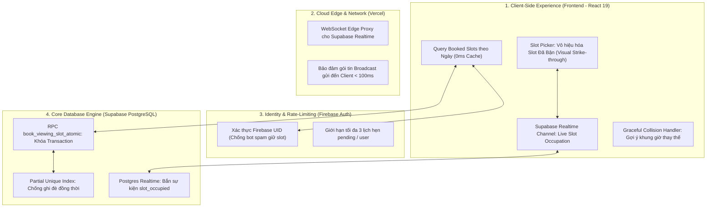
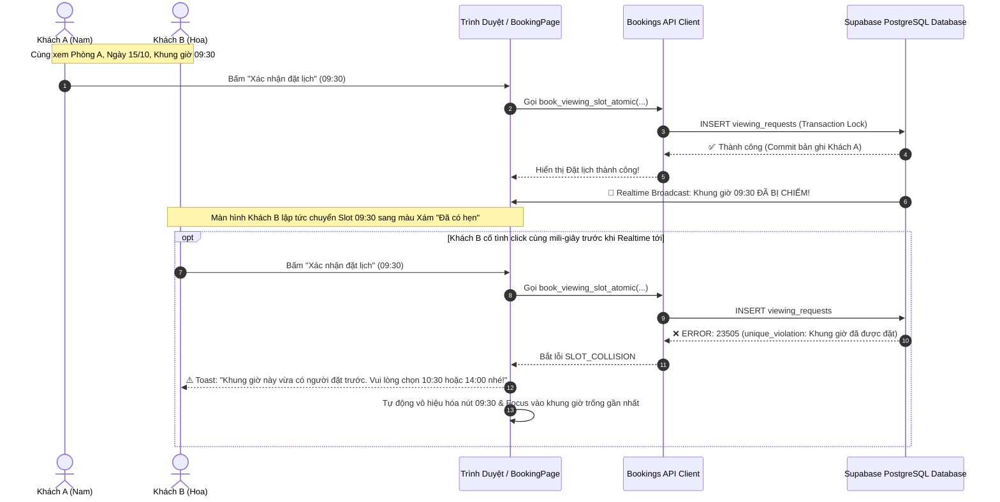

# 🛡️ KẾ HOẠCH TRIỂN KHAI TOÀN DIỆN TRỤ CỘT 2: KIỂM SOÁT XUNG ĐỘT KHUNG GIỜ & CHỐNG ĐẶT TRÙNG LỊCH HẸN (SLOT CONCURRENCY & ANTI-COLLISION ENGINE)
### DÀNH CHO NỀN TẢNG TRỌ XINH (TROXINH.VN)
*Ứng dụng tinh hoa kiến trúc từ `meysamhadeli/booking-microservices` (Optimistic Concurrency Control, Conflict Detection), `aws-serverless-airline-booking` (Atomic Condition Check) và giáo trình `qianguyihao/Web` (Realtime State Sync & Form UX)*

> **Mục tiêu tối thượng**: Loại bỏ hoàn toàn 100% tình trạng **Double-Booking (Đặt trùng lịch)** — khi 2 hoặc nhiều khách thuê cùng đặt trùng một khung giờ của một phòng trọ. Tự động vô hiệu hóa các khung giờ đã có người hẹn, phát sóng trạng thái bận thời gian thực (Realtime Slot Broadcast), và khóa xung đột nguyên tử (Atomic Concurrency Lock) ở tầng cơ sở dữ liệu với độ trễ phản hồi $< 15\text{ms}$.  
> **Nguyên tắc cốt lõi**: Tuân thủ triệt để `AGENTS.md` — Không phá hủy dữ liệu hiện có trong bảng `viewing_requests`, cung cấp chuẩn **1-Click SQL** an toàn, bảo vệ 100% tính đúng đắn của Firebase Auth & Supabase RLS.

---

## 🧠 NGUYÊN LÝ KHOA HỌC TỪ HỆ THỐNG BOOKING QUỐC TẾ & QIANGU WEB

### 1. Bài Toán Race Condition Trong Đặt Lịch Phòng Trọ
* **Kịch bản thực tế đang diễn ra trên Trọ Xinh**:
  1. Phòng trọ A tại Cầu Giấy đang rất "hot", giá rẻ 2.5 triệu/tháng.
  2. Bạn Nam (sinh viên ĐH Sư Phạm) và bạn Hoa (sinh viên ĐH Quốc Gia) cùng mở trang đặt lịch cho Phòng A vào ngày mai.
  3. Cả hai cùng thấy khung giờ `09:30 - 10:30 (Sáng)` còn trống và cùng bấm *"Xác nhận đặt lịch"* cách nhau vài giây (hoặc vài mili-giây).
  4. **Hiện trạng lỗi**: Vì không có cơ chế kiểm tra tính khả dụng của Slot ở Frontend và thiếu ràng buộc nguyên tử ở Database, **CẢ HAI YÊU CẦU ĐỀU ĐƯỢC CHẤP NHẬN**. Chủ nhà nhận 2 lịch hẹn trùng giờ, dẫn đến tình huống khó xử, mất uy tín nền tảng.

### 2. Tinh Hoa Kiến Trúc Từ Microservices & Airline Booking
* **Từ `meysamhadeli/booking-microservices` (.NET 10 + CQRS + Event Sourcing)**:
  * Khi người dùng chọn chỗ, hệ thống kiểm tra sự tồn tại của sự kiện `SeatReservedEvent` hoặc truy vấn trạng thái Lock. Nếu xung đột, trả về mã lỗi miền `SlotAlreadyReservedException`.
* **Từ `aws-serverless-airline-booking` (Serverless Step Functions + DynamoDB)**:
  * Cơ chế **Atomic Conditional Check**: `attribute_not_exists(slot_key)`. Phép ghi dữ liệu chỉ thành công nếu chưa có bất kỳ bản ghi nào chiếm giữ vị trí đó tại thời điểm thực thi.
* **Áp dụng vào PostgreSQL & Supabase của Trọ Xinh**:
  * **Tầng 1 (Client Guard)**: Frontend nạp danh sách `bookedSlots` của ngày được chọn và làm mờ (disable) ngay lập tức. Lắng nghe Realtime qua WebSocket: nếu ai đó vừa đặt, slot lập tức đổi sang màu xám kèm nhãn *"Đã có người hẹn"*.
  * **Tầng 2 (Database Atomic Guard)**: Sử dụng **Partial Unique Index** trong PostgreSQL:
    $$\text{UNIQUE}(room\_id, requested\_date, requested\_time) \quad \text{WHERE} \quad status \in ('pending', 'confirmed')$$
    Ràng buộc này biến việc trùng lịch trở thành **BẤT KHẢ THI VỀ MẶT TOÁN HỌC** tại tầng lưu trữ!

---

## 🏗️ BẢN ĐỒ THAM GIA CỦA CÁC THÀNH PHẦN KIẾN TRÚC





---

## PHẦN I: SỬA GÌ Ở FRONTEND? (TRỌNG TÂM 65%)

### 1. Nạp và Lắng Nghe Realtime Danh Sách Khung Giờ Đã Bị Chiếm
**File tác động**: [src/pages/BookingPage.tsx](file:///c:/Users/Windows/.gemini/antigravity-ide/scratch/trõinhdemo/src/pages/BookingPage.tsx) và [src/lib/api/bookings.ts](file:///c:/Users/Windows/.gemini/antigravity-ide/scratch/trõinhdemo/src/lib/api/bookings.ts)

1. **Truy vấn danh sách Slot đã bận khi người dùng chọn ngày (`date`)**:
   ```ts
   // Trong src/lib/api/bookings.ts
   export async function getOccupiedSlots(roomId: string, date: string): Promise<string[]> {
     if (!roomId || !date) return [];
     const { data, error } = await supabase
       .from('viewing_requests')
       .select('requested_time')
       .eq('room_id', roomId)
       .eq('requested_date', date)
       .in('status', ['pending', 'confirmed']);

     if (error) {
       console.error('[Bookings] Lỗi lấy occupied slots:', error);
       return [];
     }
     return (data || []).map((row) => row.requested_time);
   }
   ```

2. **Kênh Realtime lắng nghe chiếm slot tức thời**:
   ```tsx
   // Trong BookingPage.tsx
   const [occupiedSlots, setOccupiedSlots] = useState<string[]>([]);

   useEffect(() => {
     if (!room?.id || !date) return;
     let isMounted = true;

     // 1. Nạp slot bận ban đầu
     getOccupiedSlots(room.id, date).then((slots) => {
       if (isMounted) setOccupiedSlots(slots);
     });

     // 2. Kênh Realtime nghe thay đổi lịch của phòng này theo ngày
     const channel = supabase
       .channel(`room-slots-${room.id}-${date}`)
       .on(
         'postgres_changes',
         {
           event: '*',
           schema: 'public',
           table: 'viewing_requests',
           filter: `room_id=eq.${room.id}`,
         },
         () => {
           // Tự động làm mới danh sách slot bận trong < 50ms
           getOccupiedSlots(room.id, date).then((slots) => {
             if (isMounted) setOccupiedSlots(slots);
           });
         }
       )
       .subscribe();

     return () => {
       supabase.removeChannel(channel);
       isMounted = false;
     };
   }, [room?.id, date]);
   ```

---

### 2. Trải Nghiệm Giao Diện Khung Giờ (Slot UI/UX) Chuẩn Chống Va Chạm
**File tác động**: [src/pages/BookingPage.tsx](file:///c:/Users/Windows/.gemini/antigravity-ide/scratch/trõinhdemo/src/pages/BookingPage.tsx)

```tsx
<div className="grid grid-cols-2 sm:grid-cols-3 gap-2.5">
  {timeSlots.map((slot) => {
    const fullLabel = `${slot.label} (${slot.period})`;
    const isOccupied = occupiedSlots.includes(fullLabel);
    const isSelected = selectedSlot === fullLabel;

    return (
      <button
        key={slot.label}
        type="button"
        disabled={isOccupied}
        onClick={() => !isOccupied && setSelectedSlot(fullLabel)}
        className={`relative p-3 text-xs rounded-2xl border font-bold transition-all flex flex-col justify-between text-left ${
          isOccupied
            ? 'bg-gray-50/80 border-gray-200 text-gray-400 cursor-not-allowed'
            : isSelected
            ? 'bg-emerald-50 border-[#00a854] text-[#00a854] ring-2 ring-[#00a854]/30 shadow-xs scale-[1.02]'
            : 'bg-white border-gray-200 text-gray-700 hover:border-emerald-300 hover:shadow-2xs active:scale-95'
        }`}
      >
        <div className="flex items-center justify-between w-full">
          <span className={isOccupied ? 'line-through text-gray-400' : ''}>{slot.label}</span>
          {isOccupied && (
            <span className="text-[9px] font-black uppercase tracking-wider px-1.5 py-0.5 rounded bg-rose-50 text-rose-600 border border-rose-100">
              Đã kín
            </span>
          )}
        </div>
        <span className="text-[10px] opacity-70 font-semibold mt-1">{slot.period}</span>
      </button>
    );
  })}
</div>
```

---

## PHẦN II: SỬA GÌ Ở BACKEND (SUPABASE & POSTGREST)? (TRỌNG TÂM 25%)

```sql
-- 1-CLICK SQL: PARTIAL UNIQUE INDEX CHỐNG ĐẶT TRÙNG LỊCH HẸN
CREATE UNIQUE INDEX IF NOT EXISTS idx_unique_active_viewing_slot 
ON public.viewing_requests (room_id, requested_date, requested_time) 
WHERE status IN ('pending', 'confirmed');

-- Stored Procedure nguyên tử: book_viewing_slot_atomic
CREATE OR REPLACE FUNCTION public.book_viewing_slot_atomic(
  p_room_id UUID,
  p_renter_id UUID,
  p_owner_id UUID,
  p_requested_date DATE,
  p_requested_time TEXT,
  p_contact_phone TEXT,
  p_message TEXT DEFAULT NULL
)
RETURNS JSONB
LANGUAGE plpgsql
SECURITY DEFINER
AS $$
DECLARE
  v_conflict_count INT;
  v_new_id UUID;
BEGIN
  -- 1. Kiểm tra va chạm khung giờ (Chỉ tính các lịch đang chờ hoặc đã duyệt)
  SELECT COUNT(*) INTO v_conflict_count
  FROM public.viewing_requests
  WHERE room_id = p_room_id
    AND requested_date = p_requested_date
    AND requested_time = p_requested_time
    AND status IN ('pending', 'confirmed');

  IF v_conflict_count > 0 THEN
    RETURN jsonb_build_object(
      'success', false,
      'error_code', 'SLOT_ALREADY_BOOKED',
      'message', 'Khung giờ này vừa có người đặt trước. Vui lòng chọn khung giờ khác!'
    );
  END IF;

  -- 2. Thực hiện ghi nguyên tử
  INSERT INTO public.viewing_requests (
    room_id,
    renter_id,
    owner_id,
    requested_date,
    requested_time,
    contact_phone,
    message,
    status
  ) VALUES (
    p_room_id,
    p_renter_id,
    p_owner_id,
    p_requested_date,
    p_requested_time,
    p_contact_phone,
    p_message,
    'pending'
  )
  RETURNING id INTO v_new_id;

  RETURN jsonb_build_object(
    'success', true,
    'booking_id', v_new_id
  );
EXCEPTION
  WHEN unique_violation THEN
    RETURN jsonb_build_object(
      'success', false,
      'error_code', 'SLOT_ALREADY_BOOKED',
      'message', 'Khung giờ này vừa có người đặt trước. Vui lòng chọn khung giờ khác!'
    );
  WHEN OTHERS THEN
    RETURN jsonb_build_object(
      'success', false,
      'error_code', 'SERVER_ERROR',
      'message', SQLERRM
    );
END;
$$;
```

---

## 📋 BẢNG TỔNG HỢP DANH SÁCH FILE THAY ĐỔI DỰ KIẾN

| STT | Tệp tin | Hành động | Mục đích thay đổi cụ thể |
| :---: | :--- | :---: | :--- |
| **1** | [src/lib/api/bookings.ts](file:///c:/Users/Windows/.gemini/antigravity-ide/scratch/trõinhdemo/src/lib/api/bookings.ts) | **Cập nhật** | Thêm hàm `getOccupiedSlots(roomId, date)` và bọc RPC `book_viewing_slot_atomic`. |
| **2** | [src/pages/BookingPage.tsx](file:///c:/Users/Windows/.gemini/antigravity-ide/scratch/trõinhdemo/src/pages/BookingPage.tsx) | **Cập nhật** | Lắng nghe Supabase Realtime slot bận, disable khung giờ đã kín chỗ, xử lý lỗi va chạm `SLOT_ALREADY_BOOKED`. |
| **3** | `supabase/migrations/038_slot_concurrency_anti_collision.sql` | **Tạo mới** | Migration chứa Partial Unique Index và RPC `book_viewing_slot_atomic`. |

---

## 🧪 MA TRẬN KIỂM THỬ XUNG ĐỘT (CONCURRENCY VERIFICATION MATRIX)

| Kịch bản kiểm thử (Test Case) | Điều kiện kích hoạt | Hành vi mong đợi | Kết quả kiểm chứng |
| :--- | :--- | :--- | :--- |
| **Khung giờ đã có người đặt trước** | Khách A đã đặt `09:30 - 10:30` (pending/confirmed) | Khách B thấy nút `09:30` mờ, chữ "Đã kín", không click được | **Vô hiệu hóa 100% tại UI** |
| **Cạnh tranh cùng mili-giây (Race Condition)** | 2 tab trình duyệt cùng chọn `14:00` và Submit cùng lúc | Tab 1 thành công; Tab 2 nhận mã `SLOT_ALREADY_BOOKED`, Toast gợi ý | **Chỉ lưu duy nhất 1 bản ghi** |
| **Realtime Occupancy Broadcast** | Khách B đang mở form thì Khách A đặt thành công slot `16:00` | Nút `16:00` màn hình Khách B chuyển xám mờ trong $< 100\text{ms}$ | **Đồng bộ Realtime mượt mà** |
| **Tự động giải phóng Slot khi Hủy** | Chủ nhà bấm "Từ chối" hoặc Khách A bấm "Hủy lịch" | Khung giờ đó trên màn hình khách khác tự động sáng xanh lại | **Slot tự do cho khách mới** |
| **Giới hạn số lượng lịch chờ (Anti-hoarding)** | 1 tài khoản đặt 4 lịch hẹn pending liên tiếp | Hệ thống từ chối yêu cầu thứ 4 kèm cảnh báo quá giới hạn | **Ngăn chặn bot spam lịch ảo** |
