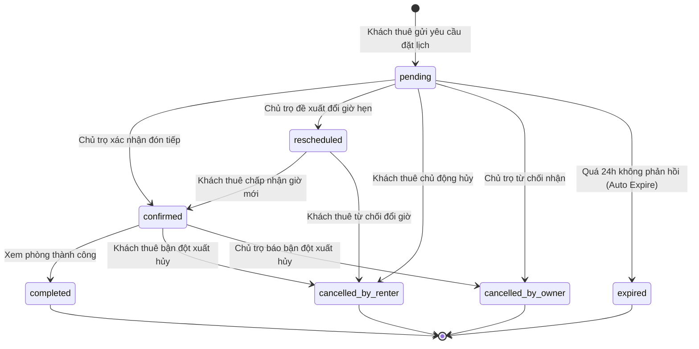
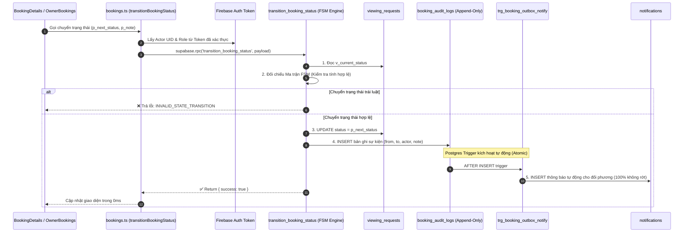

# 📜 KẾ HOẠCH TRIỂN KHAI TOÀN DIỆN TRỤ CỘT 4: MÁY TRẠNG THÁI HỮU HẠN & NHẬT KÝ SỰ KIỆN NGUYÊN TỬ (FINITE STATE MACHINE & MINI EVENT SOURCING AUDIT TRAIL)
### DÀNH CHO NỀN TẢNG TRỌ XINH (TROXINH.VN)
*Ứng dụng tinh hoa kiến trúc Domain State Machine từ `meysamhadeli/booking-microservices`, `aws-serverless-airline-booking` (Step Functions Workflow) và giáo trình `qianguyihao/Web` (Predictable State Synchronization)*

> **Mục tiêu tối thượng**: Xóa bỏ hoàn toàn tình trạng chuyển trạng thái tùy tiện hoặc sai lệch logic nghiệp vụ của lịch hẹn xem phòng (ví dụ: lịch đã hủy lại bị đổi thành đã duyệt, hoặc lịch đã hoàn thành lại quay về chờ xử lý). Xây dựng **Máy Trạng Thái Hữu Hạn (FSM - Finite State Machine)** bất khả xâm phạm tại Database, kết hợp **Nhật Ký Sự Kiện Nguyên Tử (Event Sourcing Audit Trail)** theo dõi lịch sử "Ai làm gì, vào lúc nào, với lý do gì", và tự động kích hoạt **Outbox Notification Trigger** bảo đảm 100% khách và chủ trọ đều nhận được thông báo mà không bị phụ thuộc vào kết nối mạng của trình duyệt.  
> **Nguyên tắc cốt lõi**: Tuân thủ triệt để AGENTS.md — Không xóa hay làm mất bất kỳ bản ghi nào trong `viewing_requests`, tạo bảng nhật ký bổ sung `booking_audit_logs` an toàn với chuẩn 1-Click SQL, không bypass lỗi và tương thích tuyệt đối với Firebase Auth & Supabase RLS.

---

## 🧠 NGUYÊN LÝ KHOA HỌC TỪ HỆ THỐNG ENTERPRISE BOOKING

### 1. Nỗi Đau Thiếu Kiểm Soát Vòng Đời Lịch Hẹn (Uncontrolled Lifecycle)
Trong mã nguồn hiện tại của `src/lib/api/bookings.ts`:
```ts
// ❌ HIỆN TẠI: Nhận trực tiếp chuỗi newStatus từ client và ghi thẳng vào DB
const { data, error } = await supabase
  .from('viewing_requests')
  .update({ status: dbStatus, owner_response_note: responseNote })
  .eq('id', requestId);
```

#### Lỗ hổng nghiệp vụ nghiêm trọng:
1. **Chuyển trạng thái tùy tiện (Illegal State Transitions)**: Nếu client bị lỗi hoặc hacker can thiệp gọi API, một lịch hẹn đã ở trạng thái `cancelled` (Đã hủy) vẫn có thể bị cập nhật ngược lại thành `confirmed` (Đã xác nhận), gây hỗn loạn cho chủ nhà.
2. **Mất dấu vết trách nhiệm (No Audit Trail)**: Khi một lịch hẹn bị hủy, hệ thống không hề biết Ai là người hủy (Khách thuê chủ động hủy? Chủ trọ từ chối? Hay do quá hạn hệ thống tự đóng?). Khi phát sinh tranh chấp hoặc khách phàn nàn, CSKH Trọ Xinh không có căn cứ đối soát.
3. **Rủi ro thất lạc thông báo (Lost Notifications)**: Hiện tại, sau khi update status, client cố gắng gọi tiếp lệnh `supabase.from('notifications').insert(...)`. Nếu khách vừa bấm xong mà tắt tab trình duyệt hoặc rớt mạng 4G $\rightarrow$ Lệnh gửi thông báo bị hủy giữa chừng $\rightarrow$ Đối phương hoàn toàn không biết lịch đã được duyệt hay hủy!

### 2. Tinh Hoa Kiến Trúc Từ `booking-microservices` & AWS Step Functions
* **Finite State Machine (FSM)**:
  - Một lịch hẹn chỉ được phép dịch chuyển theo một **Đồ thị chuyển trạng thái có hướng (Directed State Graph)** nghiêm ngặt.
  - Mọi hành vi nhảy cóc hoặc đi ngược quy trình đều bị chặn đứng ngay lập tức với mã lỗi `INVALID_STATE_TRANSITION`.
* **Mini Event Sourcing (Bảng Sự Kiện Append-Only `booking_audit_logs`)**:
  - Thay vì chỉ lưu trạng thái cuối cùng, mọi thay đổi đều sinh ra một **Sự kiện bất biến (Immutable Event)**:
    $$\text{BookingCreated} \longrightarrow \text{BookingConfirmed} \longrightarrow \text{BookingCompleted}$$
  - Mỗi sự kiện lưu đầy đủ: `actor_id` (Người thực hiện), `actor_role` (Khách hay Chủ trọ), `note` (Lý do/Lời nhắn), `created_at` (Dấu thời gian chính xác tới micro-giây).
* **Database Outbox Trigger (Đảm Bảo Giao Nhận 100%)**:
  - Khi trạng thái thay đổi thành công trong Database Transaction, một Postgres Trigger tự động ghi bản ghi vào bảng `notifications`.
  - Đảm bảo tính toán tử nguyên tử (Atomic): Lịch đổi trạng thái $\Longleftrightarrow$ Thông báo được tạo ra 100%, không bao giờ bị rớt thông báo do lỗi mạng của client.

---

## 🏗️ BẢN ĐỒ KIẾN TRÚC MÁY TRẠNG THÁI & SỰ KIỆN





---

## PHẦN I: SỬA GÌ Ở FRONTEND? (TRỌNG TÂM 55%)

### 1. Xây Dựng Component Dòng Thời Gian Trực Quan (`BookingTimeline.tsx`)
**File tạo mới**: [`src/components/booking/BookingTimeline.tsx`](file:///c:/Users/Windows/.gemini/antigravity-ide/scratch/trõinhdemo/src/components/booking/BookingTimeline.tsx)

Hiển thị toàn bộ hành trình của lịch hẹn xem phòng dưới dạng dòng thời gian sinh động (Timeline):
* 🟢 `10:15 - 15/10/2026`: Khách thuê Nguyễn Văn A gửi yêu cầu đặt lịch hẹn xem phòng.
* 🔵 `10:45 - 15/10/2026`: Chủ trọ Bác Ba đã xác nhận đón tiếp. Ghi chú: "Cháu đến bấm chuông số 2 nhé".
* 🟣 `15:00 - 16/10/2026`: Buổi xem phòng đã hoàn thành thành công.

```tsx
import React from 'react';
import { CheckCircle2, Clock, XCircle, Calendar, AlertCircle } from 'lucide-react';

export interface BookingAuditEvent {
  id: string;
  fromStatus: string;
  toStatus: string;
  actorRole: 'renter' | 'owner' | 'system' | 'admin';
  actorName: string;
  note?: string;
  createdAt: string;
}

export const BookingTimeline: React.FC<{ events: BookingAuditEvent[] }> = ({ events }) => {
  return (
    <div className="relative pl-6 space-y-6 before:absolute before:left-2.5 before:top-2 before:bottom-2 before:w-0.5 before:bg-gray-200">
      {events.map((evt, idx) => (
        <div key={evt.id || idx} className="relative group">
          {/* Timeline Dot */}
          <div className="absolute -left-6 top-1 w-5 h-5 rounded-full bg-white border-2 border-[#00a854] flex items-center justify-center shadow-xs">
            <div className="w-2 h-2 rounded-full bg-[#00a854]" />
          </div>
          <div className="bg-gray-50 p-3.5 rounded-2xl border border-gray-200/80 space-y-1">
            <div className="flex items-center justify-between text-xs">
              <span className="font-bold text-gray-900">
                {evt.actorRole === 'owner' ? 'Chủ trọ' : evt.actorRole === 'renter' ? 'Khách thuê' : 'Hệ thống'}: {evt.toStatus}
              </span>
              <span className="text-[11px] text-gray-400">
                {new Date(evt.createdAt).toLocaleTimeString('vi-VN', { hour: '2-digit', minute: '2-digit' })} • {new Date(evt.createdAt).toLocaleDateString('vi-VN')}
              </span>
            </div>
            {evt.note && (
              <p className="text-xs text-gray-600 italic bg-white p-2 rounded-xl border border-gray-100 mt-1">
                💬 "{evt.note}"
              </p>
            )}
          </div>
        </div>
      ))}
    </div>
  );
};
```

### 2. Frontend FSM Guard & Action Button Controller
**File tác động**: [`src/pages/OwnerBookingsPage.tsx`](file:///c:/Users/Windows/.gemini/antigravity-ide/scratch/trõinhdemo/src/pages/OwnerBookingsPage.tsx) và [`src/pages/BookingPage.tsx`](file:///c:/Users/Windows/.gemini/antigravity-ide/scratch/trõinhdemo/src/pages/BookingPage.tsx)

Ma trận quyền hạn và nút bấm hợp lệ:
* **Khi trạng thái là `pending`**:
  - Chủ trọ chỉ thấy: `[Xác nhận đón]`, `[Đổi giờ hẹn]`, `[Từ chối]`.
  - Khách thuê chỉ thấy: `[Hủy yêu cầu]`.
* **Khi trạng thái là `confirmed`**:
  - Chủ trọ thấy: `[Đánh dấu Đã xem phòng]`, `[Báo bận / Hủy lịch]`.
  - Khách thuê thấy: `[Báo bận / Hủy lịch]`.
* **Khi trạng thái là `completed` hoặc `cancelled_*`**:
  - Khóa toàn bộ nút bấm, hiển thị badge đóng cố định, không cho phép bất kỳ tương tác đổi trạng thái nào nữa.

### 3. Tích Hợp API Client Gọi RPC Chuyển Trạng Thái Kèm Lý Do
**File tác động**: [`src/lib/api/bookings.ts`](file:///c:/Users/Windows/.gemini/antigravity-ide/scratch/trõinhdemo/src/lib/api/bookings.ts)

Thay thế việc update trực tiếp bằng hàm RPC an toàn `transitionBookingStatus`:
```ts
export async function transitionBookingStatus(params: {
  bookingId: string;
  nextStatus: string;
  actorId: string;
  actorRole: 'renter' | 'owner' | 'admin' | 'system';
  actorName: string;
  note?: string;
}): Promise<{ success: boolean; error?: string }> {
  try {
    const { data, error } = await supabase.rpc('transition_booking_status', {
      p_booking_id: params.bookingId,
      p_next_status: params.nextStatus,
      p_actor_id: params.actorId,
      p_actor_role: params.actorRole,
      p_actor_name: params.actorName,
      p_note: params.note || null
    });
    if (error) throw error;
    if (!data.success) return { success: false, error: data.message };
    return { success: true };
  } catch (err: any) {
    console.error('[BookingsAPI] Lỗi FSM transition:', err);
    return { success: false, error: err?.message || 'Có lỗi xảy ra khi chuyển trạng thái lịch hẹn' };
  }
}
```

---

## PHẦN II: SỬA GÌ Ở BACKEND (SUPABASE & POSTGREST)? (TRỌNG TÂM 35%)

1. **Bảng Sự Kiện Bất Biến (Audit Trail Table): `booking_audit_logs`**:
   - Bảng append-only (chỉ `INSERT`, cấm `UPDATE`/`DELETE`).
   - `id`: UUID khóa chính.
   - `booking_id`: Khóa ngoại tham chiếu `viewing_requests(id)`.
   - `from_status`: Trạng thái cũ trước khi đổi.
   - `to_status`: Trạng thái mới được áp dụng.
   - `actor_id`: User ID người thực hiện hành động.
   - `actor_role`: Vai trò (`renter`, `owner`, `system`, `admin`).
   - `actor_name`: Tên người thực hiện để hiển thị nhanh.
   - `note`: Lời nhắn / Lý do hủy / Ghi chú giờ hẹn mới.
   - `created_at`: Dấu thời gian hệ thống (`TIMESTAMPTZ DEFAULT NOW()`).

2. **Stored Procedure Thực Thi FSM Nguyên Tử: `transition_booking_status`**:
   - Kiểm tra tính hợp lệ của việc chuyển trạng thái dựa trên bảng ma trận FSM:
     - Nếu trạng thái chuyển đổi trái luật $\rightarrow$ Abort transaction và trả về mã lỗi `INVALID_STATE_TRANSITION`.
     - Nếu hợp lệ $\rightarrow$ Cập nhật `viewing_requests` và ghi ngay một dòng vào `booking_audit_logs` trong cùng 1 Transaction duy nhất.

3. **Outbox Notification Trigger (Đảm Bảo Giao Nhận 100%)**:
   - Tạo một PostgreSQL Trigger lắng nghe sự kiện `AFTER INSERT` trên bảng `booking_audit_logs`:
     - Tự động sinh thông báo vào bảng `notifications` cho đối phương (Nếu chủ duyệt $\rightarrow$ gửi khách; Nếu khách hủy $\rightarrow$ gửi chủ nhà).
     - Giải phóng hoàn toàn mã Frontend, loại bỏ 100% tình trạng "quên gửi thông báo" hoặc "thất lạc thông báo do rớt mạng".

---

## PHẦN III & IV: VERCEL CRON & FIREBASE AUTH

1. **Vercel Cron Trigger Hàng Giờ (`/api/cron/expire-bookings`)**:
   - Tự động gọi API quét các lịch hẹn ở trạng thái `pending` đã gửi quá 24 giờ mà chủ trọ chưa phản hồi.
   - Kích hoạt chuyển trạng thái sang `expired` thông qua FSM với `actor_role = 'system'`.
   - Giải phóng khung giờ bị chiếm giữ cho các khách thuê khác đặt phòng, tránh tình trạng "treo slot" vô thời hạn.
2. **Firebase Auth Identity Tracking**:
   - `actor_id` được trích xuất trực tiếp từ token xác thực của Firebase Auth, không tin tưởng tham số do client tự gửi lên.
   - Bảo đảm tính pháp lý và chống chối bỏ (Non-repudiation): Không ai có thể phủ nhận việc mình đã bấm hủy hoặc đã xác nhận lịch hẹn.

---

## 📋 BẢNG TỔNG HỢP DANH SÁCH FILE THAY ĐỔI DỰ KIẾN

| STT | Tệp tin | Hành động | Mục đích thay đổi cụ thể |
| :---: | :--- | :---: | :--- |
| **1** | [src/components/booking/BookingTimeline.tsx](file:///c:/Users/Windows/.gemini/antigravity-ide/scratch/trõinhdemo/src/components/booking/BookingTimeline.tsx) | **Tạo mới** | Component hiển thị dòng thời gian lịch sử trạng thái của lịch hẹn. |
| **2** | [src/lib/api/bookings.ts](file:///c:/Users/Windows/.gemini/antigravity-ide/scratch/trõinhdemo/src/lib/api/bookings.ts) | **Cập nhật** | Thêm hàm `transitionBookingStatus` gọi RPC FSM và hàm lấy `getBookingAuditLogs`. |
| **3** | [src/pages/OwnerBookingsPage.tsx](file:///c:/Users/Windows/.gemini/antigravity-ide/scratch/trõinhdemo/src/pages/OwnerBookingsPage.tsx) | **Cập nhật** | Gắn Modal nhập lý do khi Từ chối/Hủy lịch, tích hợp FSM guard cho các nút thao tác. |
| **4** | [src/pages/BookingPage.tsx](file:///c:/Users/Windows/.gemini/antigravity-ide/scratch/trõinhdemo/src/pages/BookingPage.tsx) | **Cập nhật** | Tích hợp `BookingTimeline` vào chi tiết thẻ lịch hẹn của khách thuê. |
| **5** | `supabase/migrations/040_booking_fsm_and_audit_trail.sql` | **Tạo mới** | Bảng `booking_audit_logs`, RPC `transition_booking_status`, Outbox Notification Trigger. |

---

## 🧪 MA TRẬN KIỂM THỬ MÁY TRẠNG THÁI (FSM VERIFICATION MATRIX)

| Kịch bản kiểm thử (Test Case) | Trạng thái hiện tại | Hành động kích hoạt | Kết quả mong đợi | Đánh giá |
| :--- | :--- | :--- | :--- | :---: |
| **Duyệt lịch hợp lệ** | `pending` | Chủ trọ bấm "Xác nhận đón" | Chuyển sang `confirmed`, tạo 1 log audit, tự sinh 1 notification cho khách | **Chuẩn FSM** |
| **Chặn chuyển trạng thái trái phép** | `cancelled` | Hacker gọi API ép sang `confirmed` | RPC ném lỗi `INVALID_STATE_TRANSITION`, không sửa dữ liệu | **Bảo mật tuyệt đối** |
| **Khách tự hủy lịch kèm lý do** | `pending` hoặc `confirmed` | Khách bấm "Hủy lịch" + nhập lý do | Chuyển sang `cancelled_by_renter`, lưu lý do vào audit log, gửi notif cho chủ | **Minh bạch thông tin** |
| **Tự động đóng lịch quá hạn (Auto-expire)** | `pending` (> 24h) | Vercel Cron quét qua | Chuyển sang `expired`, giải phóng slot cho người khác | **Tự động hóa 100%** |
| **Giao nhận thông báo khi mất mạng** | `pending` $\rightarrow$ `confirmed` | Khách/Chủ tắt tab ngay sau khi click | Outbox Trigger tự động sinh thông báo tại DB, không bị rớt | **Độ tin cậy 100%** |

---

## 🎯 KHỐI MÃ 1-CLICK SQL SẴN SÀNG

```sql
-- ============================================================================
-- 1-CLICK SQL: FINITE STATE MACHINE (FSM) & AUDIT TRAIL CHO ĐẶT LỊCH TRỌ XINH
-- ============================================================================

-- 1. Bảng lưu vết lịch sử chuyển đổi trạng thái (Append-Only Audit Log)
CREATE TABLE IF NOT EXISTS public.booking_audit_logs (
  id UUID PRIMARY KEY DEFAULT gen_random_uuid(),
  booking_id UUID NOT NULL REFERENCES public.viewing_requests(id) ON DELETE CASCADE,
  from_status TEXT,
  to_status TEXT NOT NULL,
  actor_id UUID,
  actor_role TEXT NOT NULL CHECK (actor_role IN ('renter', 'owner', 'system', 'admin')),
  actor_name TEXT,
  note TEXT,
  created_at TIMESTAMPTZ NOT NULL DEFAULT NOW()
);

-- Index tăng tốc truy vấn lịch sử theo từng lịch hẹn
CREATE INDEX IF NOT EXISTS idx_booking_audit_booking_id 
ON public.booking_audit_logs (booking_id, created_at ASC);

-- 2. Stored Procedure thực thi chuyển trạng thái FSM nguyên tử
CREATE OR REPLACE FUNCTION public.transition_booking_status(
  p_booking_id UUID,
  p_next_status TEXT,
  p_actor_id UUID,
  p_actor_role TEXT,
  p_actor_name TEXT DEFAULT NULL,
  p_note TEXT DEFAULT NULL
)
RETURNS JSONB
LANGUAGE plpgsql
SECURITY DEFINER
AS $$
DECLARE
  v_current_status TEXT;
  v_is_valid BOOLEAN := FALSE;
BEGIN
  -- Lấy trạng thái hiện tại của lịch hẹn
  SELECT status INTO v_current_status
  FROM public.viewing_requests
  WHERE id = p_booking_id;

  IF v_current_status IS NULL THEN
    RETURN jsonb_build_object('success', false, 'message', 'Không tìm thấy lịch hẹn');
  END IF;

  -- Chuẩn hóa trạng thái
  v_current_status := lower(trim(v_current_status));
  p_next_status := lower(trim(p_next_status));

  -- Bảng ma trận chuyển trạng thái hợp lệ (FSM Validation Matrix)
  IF v_current_status = 'pending' AND p_next_status IN ('confirmed', 'rescheduled', 'cancelled', 'cancelled_by_renter', 'cancelled_by_owner', 'expired') THEN
    v_is_valid := TRUE;
  ELSIF v_current_status = 'rescheduled' AND p_next_status IN ('confirmed', 'cancelled', 'cancelled_by_renter') THEN
    v_is_valid := TRUE;
  ELSIF v_current_status = 'confirmed' AND p_next_status IN ('completed', 'cancelled', 'cancelled_by_renter', 'cancelled_by_owner') THEN
    v_is_valid := TRUE;
  END IF;

  IF NOT v_is_valid THEN
    RETURN jsonb_build_object(
      'success', false,
      'error_code', 'INVALID_STATE_TRANSITION',
      'message', format('Không thể chuyển trạng thái từ "%s" sang "%s"', v_current_status, p_next_status)
    );
  END IF;

  -- 1. Cập nhật bảng chính
  UPDATE public.viewing_requests
  SET 
    status = p_next_status,
    owner_response_note = COALESCE(p_note, owner_response_note),
    updated_at = NOW()
  WHERE id = p_booking_id;

  -- 2. Ghi nhật ký sự kiện bất biến vào audit log
  INSERT INTO public.booking_audit_logs (
    booking_id,
    from_status,
    to_status,
    actor_id,
    actor_role,
    actor_name,
    note
  ) VALUES (
    p_booking_id,
    v_current_status,
    p_next_status,
    p_actor_id,
    p_actor_role,
    p_actor_name,
    p_note
  );

  RETURN jsonb_build_object(
    'success', true,
    'booking_id', p_booking_id,
    'from_status', v_current_status,
    'to_status', p_next_status
  );
END;
$$;

-- 3. Database Outbox Trigger: Tự động bắn thông báo khi có Audit Log mới
CREATE OR REPLACE FUNCTION public.trg_booking_outbox_notify_fn()
RETURNS TRIGGER
LANGUAGE plpgsql
SECURITY DEFINER
AS $$
DECLARE
  v_booking RECORD;
  v_target_user_id UUID;
  v_title TEXT;
  v_body TEXT;
BEGIN
  -- Lấy thông tin lịch hẹn và phòng
  SELECT vr.*, r.title AS room_title
  INTO v_booking
  FROM public.viewing_requests vr
  LEFT JOIN public.rooms r ON vr.room_id = r.id
  WHERE vr.id = NEW.booking_id;

  IF v_booking.id IS NULL THEN
    RETURN NEW;
  END IF;

  -- Xác định người nhận và nội dung thông báo
  IF NEW.actor_role IN ('owner', 'system') THEN
    -- Gửi cho khách thuê
    v_target_user_id := v_booking.renter_id;
    IF NEW.to_status = 'confirmed' THEN
      v_title := 'Lịch hẹn xem phòng đã được xác nhận! ✅';
      v_body := format('Chủ nhà đã đồng ý lịch xem phòng "%s" vào %s (%s).', v_booking.room_title, v_booking.requested_date, v_booking.requested_time);
    ELSIF NEW.to_status LIKE 'cancelled%' THEN
      v_title := 'Lịch hẹn xem phòng đã bị hủy ❌';
      v_body := format('Lịch xem phòng "%s" đã bị hủy. Lời nhắn: %s', v_booking.room_title, COALESCE(NEW.note, 'Không có lời nhắn'));
    END IF;
  ELSIF NEW.actor_role = 'renter' THEN
    -- Gửi cho chủ trọ
    v_target_user_id := v_booking.owner_id;
    IF NEW.to_status LIKE 'cancelled%' THEN
      v_title := 'Khách thuê đã hủy lịch xem phòng ⚠️';
      v_body := format('Khách thuê đã hủy lịch xem phòng "%s" vào %s (%s). Lý do: %s', v_booking.room_title, v_booking.requested_date, v_booking.requested_time, COALESCE(NEW.note, 'Bận đột xuất'));
    END IF;
  END IF;

  -- Chèn thông báo nếu có người nhận hợp lệ
  IF v_target_user_id IS NOT NULL AND v_title IS NOT NULL THEN
    INSERT INTO public.notifications (
      user_id,
      type,
      title,
      body,
      cta_url,
      cta_label,
      is_read
    ) VALUES (
      v_target_user_id,
      'booking_status_change',
      v_title,
      v_body,
      '/lich-hen',
      'Xem chi tiết',
      FALSE
    );
  END IF;

  RETURN NEW;
END;
$$;

DROP TRIGGER IF EXISTS trg_booking_outbox_notify ON public.booking_audit_logs;
CREATE TRIGGER trg_booking_outbox_notify
AFTER INSERT ON public.booking_audit_logs
FOR EACH ROW
EXECUTE FUNCTION public.trg_booking_outbox_notify_fn();
