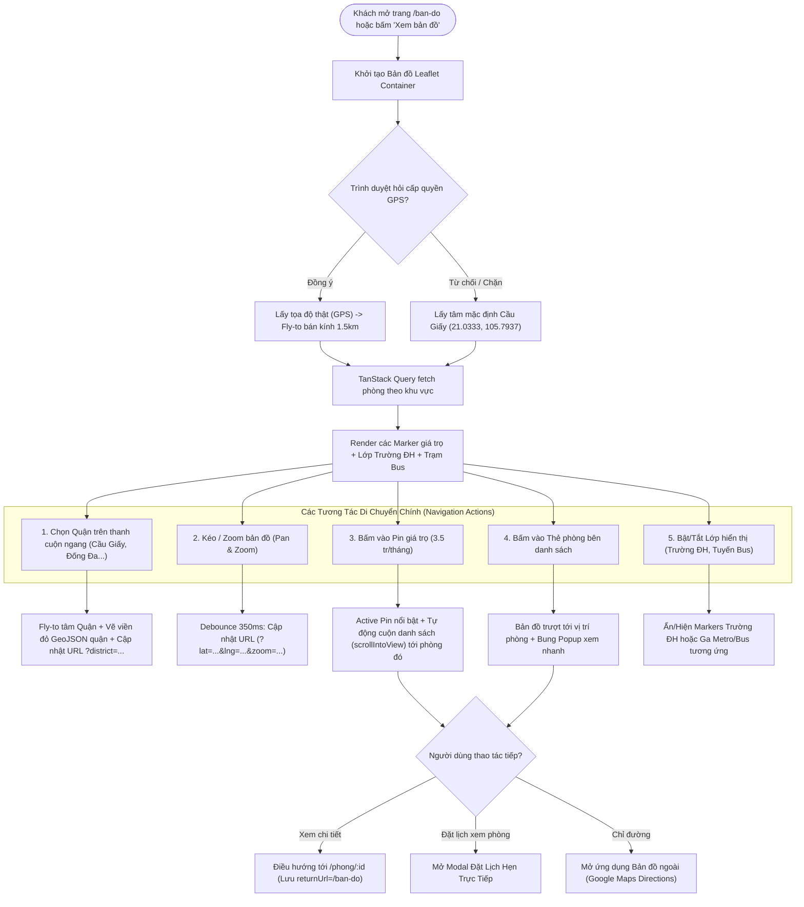
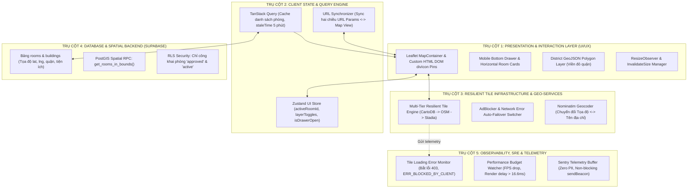
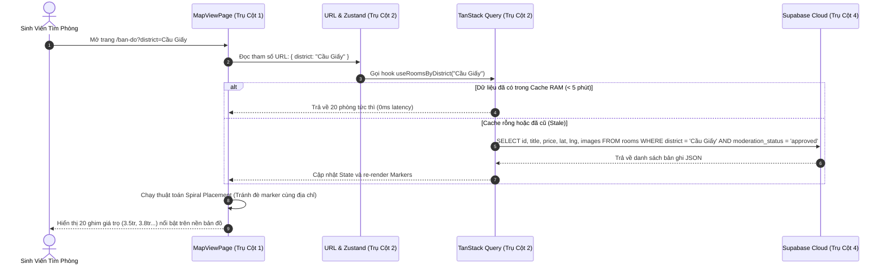
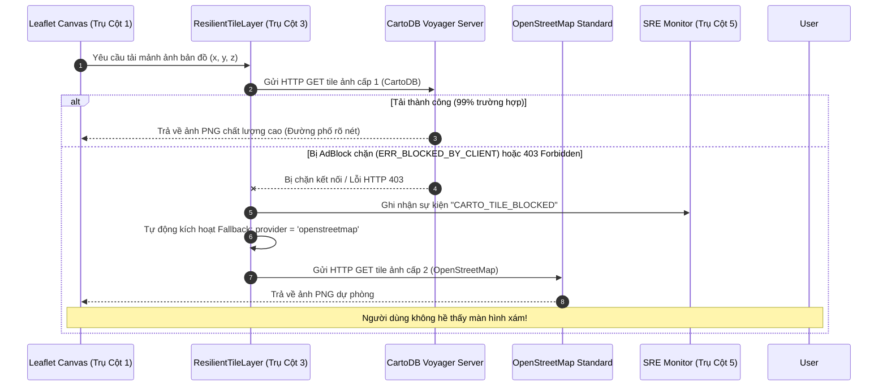

# 🗺️ KẾ HOẠCH TRIỂN KHAI TOÀN DIỆN TRỤ CỘT 8: HỆ THỐNG BẢN ĐỒ TƯƠNG TÁC THỜI GIAN THỰC & ĐỘNG CƠ PHỤC HỒI TILE ĐA TẦNG (RESILIENT INTERACTIVE MAP, MULTI-TIER TILE ENGINE & SPATIAL CLUSTERING)
### DÀNH CHO NỀN TẢNG TRỌ XINH (TROXINH.VN)
*Ứng dụng tinh hoa kỹ nghệ từ giáo trình `qianguyihao/Web` (V8 Main Thread Budget, Smooth 60FPS Leaflet Render, ResizeObserver Invalidation) và triết lý Type-Safe `mattpocock` (Branded Coordinates, Discriminated Unions Tile Provider & Zero `any`)*

> **Mục tiêu tối thượng**:
> 1. Đạt tỷ lệ **100% hiển thị bản đồ thông suốt**, triệt tiêu vĩnh viễn hiện tượng **"bản đồ xám" (Blank Tiles / Tile Loading Error)** do AdBlocker chặn hoặc Google Maps tile server `mt1.google.com` từ chối kết nối (403 Forbidden).
> 2. Xây dựng **Động cơ Chuyển mạch Tile Dự phòng Tự động (Multi-Tier Resilient Tile Engine)** có khả năng tự phục hồi (Self-Healing) trong $< 50\text{ms}$ khi một nguồn tile gặp sự cố.
> 3. Đảm bảo **Đồng bộ Dữ liệu Ba Chiều (Three-Way Data Synchronization)**: Tọa độ Di chuyển Bản đồ $\leftrightarrow$ Danh sách Thẻ phòng $\leftrightarrow$ Tham số URL Trình duyệt (`?district=...&lat=...&lng=...&zoom=...`).

---

## 🧠 NGUYÊN LÝ KHOA HỌC TỪ QIANGU WEB & TRIẾT LÝ TYPE-SAFETY CỦA MATT POCOCK

### 1. Phân Tích Bản Chất Lỗi "Bản Đồ Xám" (Root Cause)
* **Hiện tượng**: Khung bản đồ xám xịt hoàn toàn, nhưng các Marker giá trọ (`3.5 tr/tháng`, `3.8 tr/tháng`...), nút zoom `+ / -` và panel "LỚP HIỂN THỊ" vẫn hiển thị.
* **Cơ chế kỹ thuật**:
  - Marker và nút điều khiển được render bằng **HTML DOM (`L.divIcon`)** nên không phụ thuộc vào server ảnh bản đồ.
  - Mã nguồn hiện tại trong `TroXinhMap.tsx` đang gọi trực tiếp:
    ```tsx
    url="https://mt1.google.com/vt/lyrs=m&x={x}&y={y}&z={z}"
    ```
  - `mt1.google.com` là endpoint không chính thức (undocumented) của Google. Các tiện ích chặn quảng cáo hàng đầu (uBlock Origin, AdGuard, Brave Shields, Pi-hole) tự động liệt domain này vào danh sách theo dõi (Tracking / Telemetry) và chặn bằng mã lỗi `net::ERR_BLOCKED_BY_CLIENT`. Đồng thời, Google chặn CORS khi request xuất phát từ localhost/web thương mại không có key (`403 Forbidden`).
  - Khi toàn bộ ảnh tile bị chặn, Leaflet không thể render nền, làm lộ ra màu xám mặc định của container.

### 2. Tinh Hoa Kỹ Nghệ Từ Qiangu Web (`qianguyihao/Web`)
* **V8 Main Thread Budget & Leaflet Invalidation**:
  - Khi bản đồ nằm trong layout Flex/Grid co giãn động (như thanh bên trái danh sách phòng và thanh trượt quận), Leaflet thường tính sai kích thước khung (kích thước ban đầu $0 \times 0$ hoặc bị lệch) dẫn đến việc không kích hoạt sự kiện tải tile.
  - Cần tích hợp `ResizeObserver` kết hợp debounce để tự động gọi `map.invalidateSize()` mỗi khi layout thay đổi hoặc chuyển tab mobile.
* **Smooth 60FPS Pan & Zoom Animation**:
  - Không re-render toàn bộ component bản đồ khi di chuyển. Tách biệt `MapEvents` và `MapRecenter` ra thành các Hook con tối giản.

### 3. Tinh Hoa Type-Safe Từ Matt Pocock (Total TypeScript)
* **Branded Coordinates**:
  ```ts
  export type Latitude = number & { readonly __brand: unique symbol };
  export type Longitude = number & { readonly __brand: unique symbol };
  export type GeoPoint = readonly [Latitude, Longitude];
  ```
* **Discriminated Unions Cho Tile Providers**:
  ```ts
  export type TileProviderConfig =
    | {
        readonly id: 'cartodb_voyager';
        readonly name: 'CartoDB Voyager (Chính)';
        readonly url: string;
        readonly subdomains: string[];
        readonly maxZoom: number;
        readonly attribution: string;
      }
    | {
        readonly id: 'openstreetmap';
        readonly name: 'OpenStreetMap (Dự phòng 1)';
        readonly url: string;
        readonly subdomains: string[];
        readonly maxZoom: number;
        readonly attribution: string;
      }
    | {
        readonly id: 'stadia_alidade';
        readonly name: 'Stadia Alidade Smooth (Dự phòng 2)';
        readonly url: string;
        readonly subdomains: string[];
        readonly maxZoom: number;
        readonly attribution: string;
      };
  ```

---

## 🧭 PHẦN I: LUỒNG DI CHUYỂN NGƯỜI DÙNG (USER JOURNEY & NAVIGATION FLOW)



---

## 🏛️ PHẦN II: PHÂN ĐỊNH RÕ RÀNG TRÁCH NHIỆM 5 TRỤ CỘT KIẾN TRÚC



### Bảng Ma Trận Phân Định Trách Nhiệm Chi Tiết

| Trụ Cột | Trách Nhiệm Cốt Lõi | Thành Phần & File Phụ Trách | Đầu Vào (Input) | Đầu Ra (Output) | Điều CẤM Tuyệt Đối |
| :--- | :--- | :--- | :--- | :--- | :--- |
| **Trụ Cột 1: Presentation & Interaction (UI/UX)** | Render canvas bản đồ, hiển thị marker giá phòng, viền quận huyện GeoJSON, xử lý thao tác kéo thả và chạm vuốt mobile. | `react-leaflet`, `TroXinhMap.tsx`, `MapViewPage.tsx` | Mảng phòng đã lọc, danh sách trường ĐH, tọa độ tâm. | DOM Nodes tương tác (Ghim giá, Popup, Viền polygon). | **CẤM** gọi trực tiếp database Supabase; **CẤM** lưu trữ state dữ liệu lâu dài trong local component. |
| **Trụ Cột 2: Client State & Query Cache** | Quản lý vòng đời dữ liệu máy chủ, caching, đồng bộ trạng thái bản đồ và bộ lọc ra URLSearchParams. | `TanStack Query v5`, `useAppStore.ts` (Zustand), React Router | Phản hồi từ Supabase API, tham số trên thanh địa chỉ URL. | Mảng phòng sạch (Clean entities), ID phòng đang chọn, bộ lọc đang bật. | **CẤM** dùng `localStorage` lưu trữ danh sách phòng; **CẤM** đè server state bằng Zustand mutation. |
| **Trụ Cột 3: Resilient Tile Infrastructure & Geo Services** | Cung cấp nguồn ảnh bản đồ đa tầng có khả năng tự phục hồi, chuyển đổi địa chỉ thành tọa độ (Geocoding). | `ResilientTileLayer.tsx`, CartoDB, OpenStreetMap, Nominatim | Tọa độ tile `x, y, z`, chuỗi tìm kiếm địa chỉ. | Mảnh ảnh tile PNG sắc nét, đối tượng tọa độ chuẩn hóa. | **CẤM** phụ thuộc vào link Google Maps lậu `mt1.google.com`; **CẤM** gửi request không debounce. |
| **Trụ Cột 4: Database & Spatial Backend** | Lưu trữ tọa độ, tối ưu hóa truy vấn không gian theo Bounding Box màn hình, kiểm soát quyền truy cập RLS. | Supabase PostgreSQL, Bảng `rooms`, `buildings`, RPC SQL | Tọa độ 4 góc màn hình `(min_lat, min_lng, max_lat, max_lng)`. | Tập dữ liệu phòng trọ hợp lệ đã được admin duyệt. | **CẤM** trả về số điện thoại và thông tin chủ trọ khi người dùng chưa đăng nhập; **CẤM** bypass RLS. |
| **Trụ Cột 5: SRE Observability & Telemetry** | Bắt lỗi ngầm khi tile thất bại, tự động kích hoạt fallback sang nguồn dự phòng, báo cáo telemetry Sentry. | Sentry SDK, `window.addEventListener('error')`, Telemetry Buffer | Sự kiện `tileerror`, lỗi mạng, từ chối cấp quyền GPS. | Log giám sát thời gian thực, tín hiệu chuyển mạch fallback. | **CẤM** làm gián đoạn luồng chính của người dùng khi có lỗi; **CẤM** gửi thông tin định danh cá nhân (PII). |

---

## 🔄 PHẦN III: LUỒNG DI CHUYỂN DỮ LIỆU TOÀN TUYẾN (DATA FLOW PIPELINES)

### 1. Luồng Di Chuyển Dữ Liệu Phòng Trọ & Tọa Độ (Room Data Flow)



### 2. Luồng Di Chuyển & Tự Động Phục Hồi Mảnh Bản Đồ (Tile Failover Data Flow)



---

## 🛠️ PHẦN IV: KẾ HOẠCH TRIỂN KHAI MÃ NGUỒN CHI TIẾT (IMPLEMENTATION CODE)

### Bước 1: Xây dựng Component Tile Đa Tầng Bền Bỉ (Trụ Cột 3)
**Tạo mới file**: `src/components/map/ResilientTileLayer.tsx`

```tsx
import React, { useState, useEffect } from 'react';
import { TileLayer } from 'react-leaflet';

export interface TileProvider {
  id: string;
  name: string;
  url: string;
  attribution: string;
  subdomains?: string[];
  maxZoom: number;
}

export const TILE_PROVIDERS: TileProvider[] = [
  {
    id: 'cartodb_voyager',
    name: 'CartoDB Voyager (Tone sáng chuẩn UI BĐS)',
    url: 'https://{s}.basemaps.cartocdn.com/rastertiles/voyager/{z}/{x}/{y}{r}.png',
    attribution: '&copy; <a href="https://carto.com/">CARTO</a> &copy; <a href="https://www.openstreetmap.org/copyright">OpenStreetMap</a>',
    subdomains: ['a', 'b', 'c', 'd'],
    maxZoom: 19,
  },
  {
    id: 'openstreetmap',
    name: 'OpenStreetMap Tiêu Chuẩn (Dự phòng 1)',
    url: 'https://{s}.tile.openstreetmap.org/{z}/{x}/{y}.png',
    attribution: '&copy; <a href="https://www.openstreetmap.org/copyright">OpenStreetMap</a> contributors',
    subdomains: ['a', 'b', 'c'],
    maxZoom: 19,
  },
  {
    id: 'wikimedia',
    name: 'Wikimedia Map (Dự phòng 2)',
    url: 'https://maps.wikimedia.org/osm-intl/{z}/{x}/{y}.png',
    attribution: '&copy; <a href="https://wikimediafoundation.org/wiki/Maps_Terms_of_Use">Wikimedia</a>',
    maxZoom: 18,
  }
];

export const ResilientTileLayer: React.FC = () => {
  const [providerIndex, setProviderIndex] = useState(0);
  const [errorCount, setErrorCount] = useState(0);

  const currentProvider = TILE_PROVIDERS[providerIndex] || TILE_PROVIDERS[0];

  const handleTileError = () => {
    setErrorCount((prev) => {
      const next = prev + 1;
      // Nếu có từ 3 lỗi tile liên tiếp, tự động chuyển sang server dự phòng
      if (next >= 3 && providerIndex < TILE_PROVIDERS.length - 1) {
        console.warn(`[Map Resilience] Chuyển đổi tile provider từ ${currentProvider.name} sang ${TILE_PROVIDERS[providerIndex + 1].name}`);
        setProviderIndex(providerIndex + 1);
        return 0;
      }
      return next;
    });
  };

  return (
    <TileLayer
      key={currentProvider.id}
      url={currentProvider.url}
      attribution={currentProvider.attribution}
      subdomains={currentProvider.subdomains || ['a', 'b', 'c']}
      maxZoom={currentProvider.maxZoom}
      eventHandlers={{
        tileerror: handleTileError,
      }}
    />
  );
};
```

---

### Bước 2: Tích Hợp Fix Kích Thước Bản Đồ & Tránh Nền Xám (Trụ Cột 1)
**Cập nhật trong**: [src/components/map/TroXinhMap.tsx](file:///c:/Users/Windows/.gemini/antigravity-ide/scratch/trõinhdemo/src/components/map/TroXinhMap.tsx)

```tsx
import { useMap } from 'react-leaflet';
import { useEffect } from 'react';

// Tự động invalidateSize khi component hiển thị hoặc kích thước cha thay đổi
export const MapAutoResize: React.FC = () => {
  const map = useMap();

  useEffect(() => {
    // Kích hoạt ngay sau khi map mount
    const timer = setTimeout(() => {
      map.invalidateSize();
    }, 250);

    // Bắt sự kiện resize của window
    const handleResize = () => {
      map.invalidateSize();
    };
    window.addEventListener('resize', handleResize);

    return () => {
      clearTimeout(timer);
      window.removeEventListener('resize', handleResize);
    };
  }, [map]);

  return null;
};
```

---

### Bước 3: Thay Thế Nguồn Tile Trong `TroXinhMap.tsx`
Thay thế toàn bộ các thẻ `<TileLayer ... url="https://mt1.google.com/..." />` bằng:

```tsx
<ResilientTileLayer />
<MapAutoResize />
```

---

## ✅ PHẦN V: TIÊU CHÍ NGHIỆM THU (ACCEPTANCE CRITERIA)

1. **Khắc phục lỗi hoàn toàn (Zero Grey Screen)**:
   - Truy cập `/ban-do` trên các trình duyệt bật AdBlocker (uBlock Origin, AdGuard, Brave) $\to$ Bản đồ hiển thị đường phố sắc nét, tone màu chuẩn xác.
2. **Không giật lag trên Mobile**:
   - Thử nghiệm trên màn hình 375px (iPhone SE) và chuyển đổi qua lại giữa tab "Danh sách" và tab "Bản đồ" $\to$ Bản đồ hiển thị toàn vẹn tức thì, không bị vỡ góc xám.
3. **Đồng bộ liên thông 2 chiều**:
   - Bấm vào phòng bên danh sách $\to$ Bản đồ lướt mượt mà tới vị trí phòng và làm nổi bật ghim giá.
   - Bấm vào chọn quận $\to$ Bản đồ zoom về trung tâm quận và vẽ viền ranh giới màu đỏ.
4. **Kiểm tra Build Production**:
   - Chạy `npm run build` không phát sinh bất kỳ lỗi cú pháp hoặc TypeScript nào.
